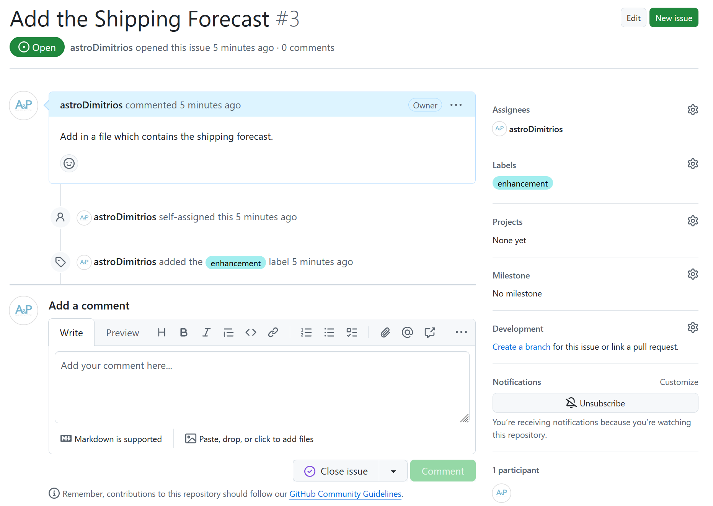

::::::::::::::::::::::::::::::::::::::: objectives

- Describe a simple development flow using git and GitHub.

::::::::::::::::::::::::::::::::::::::::::::::::::

:::::::::::::::::::::::::::::::::::::::: questions

- What does using git and GitHub look like in practice?

::::::::::::::::::::::::::::::::::::::::::::::::::

Good working practices help us avoid mistakes,
keep our codebases secure,
and help us write sustainable code.
In this lesson we'll look at what good practice using
git and GitHub might look like.

The process to develop new code with git and GitHub
looks like this:

1. Open an Issue describing the feature or bug
2. Create a branch to develop your changes on
3. Make changes to your working copy
4. Write tests
5. Write documentation
6. Open a Pull Request
7. Review your changes
8. Merge the Pull Request and close the Issue
9. Tidy up your branches

## Issues

GitHub Issues (tickets) are where you plan and track work.
You can assign individuals to Issues and label them with a
relevant tag such as `bug` or `enhancement`.
Before opening a new Issue check whether there is already
one open for the feature or bug by using GitHub's search.

{alt='A screenshot of a GitHub Issue.'}

:::::::::::::::::::::::::::::::::::::::  challenge

## Creating an Issue

Practice opening up an Issue on your `weather` repository.
Your Issue will be a feature request for the shipping forecast.

::::::::::::::::::::::::::::::::::::::::::::::::::

:::::::::::::::::::::::::::::::::::::::: keypoints

- Issues are used to track and plan work

::::::::::::::::::::::::::::::::::::::::::::::::::
