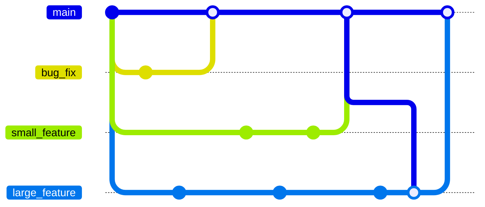
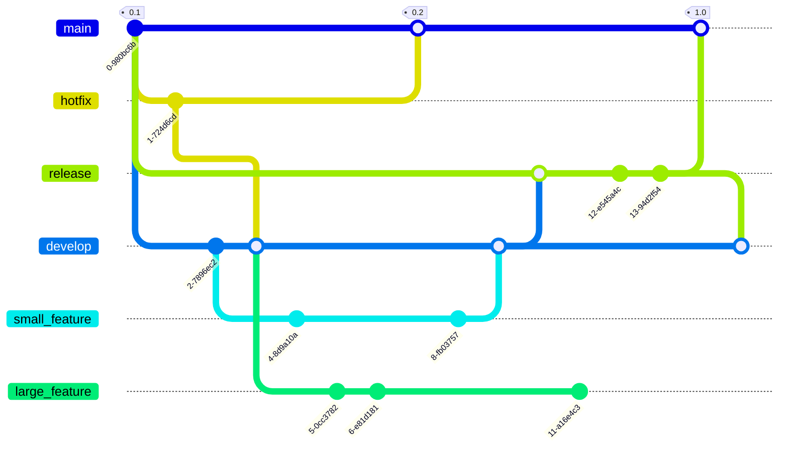

::::::::::::::::::::::::::::::::::::::: objectives

- Describe the Feature Branch and Forking models.

::::::::::::::::::::::::::::::::::::::::::::::::::

:::::::::::::::::::::::::::::::::::::::: questions

- Which branching model is best for me?

::::::::::::::::::::::::::::::::::::::::::::::::::

In the git-novice lesson you learnt how to develop features
on a branch and use a pull-request to merge the changes
back into the `main` branch. You were unknowingly using
a Git branching model called **feature branch workflow**.

As a reminder, we develop on branches to ensure that our development code
doesn't affect the production code on the `main` branch.
Branches also allow your team to develop features in parallel.

A branching model (sometimes also called strategies or workflows) is the model your team adopts when writing, merging and deploying code when using a version control system.
It is a set of rules that you must follow which outline how
your team and collaborators interact with a shared codebase.

Having a clear model helps avoid merge conflicts, more on that later,
and clearly sets out to new collaborators how they can contribute
to your repository.

In this and the following episodes, we will outline some of the branching models that teams use in order to organize their work.
We will look at their pros and cons and help decide which model you should
choose based on your teams needs.

A branching model aims to:

- Enhance productivity by ensuring proper coordination among developers
- Enable parallel development
- Help organize a series of planned, structured releases
- Map a clear path when making changes from development through to production
- Maintain a bug-free code where developers can quickly fix issues and get these changes back to production without disrupting the development workflow

## Git Branching Models

Some version control systems are more geared towards certain branching models.
When using git you have a wide range of models to pick from.
This means the first rule when collaborating using git is:
“Talk about your branching model.”

A repository's `CONTRIBUTING` file may include details of their branching model.
This information might also be in a repository's `README` file.
If in doubt ask!
You can also look at how other people appear to be contributing to the repository.

Below are a few models:

-----------------------------------------

### Feature Branch

In this model every small change or “feature” gets its own branch
where the developers make changes.
Once the feature is done, they submit a pull request and
merge it into the `main` branch after review.
Feature branches should be relatively short-lived.

#### Pros

- Each feature is developed away from `main` so you don't affect production code
- Multiple features can be developed in parallel feature branches
- It's a simple model that's easy for those new to git and your project
- Easy to set up with continuous integration testing and deployment

#### Cons

- If you don't regularly merge changes to `main` into your feature branch
  it can become outdated, leading to merge conflicts
- You may struggle if you need to maintain multiple production versions
  simultaneously in the same repository

The Feature Branch model is sometimes called GitHub Flow.

-----------------------------------------

### Forking

In this model you make a [**fork**](https://gitprotect.io/blog/git-forking-workflow/) (copy) of the whole repository you want
to contribute to on GitHub in your personal space.
You develop your changes using this fork.
When a change is ready you open a pull request to contribute the changes
back to the original repository.

#### Pros

- Removes the need to give all collaborators adequate permissions
  on your repository
- Only project maintainers can approve new code
- You can use any other model within your main repository and
  forks to develop changes

-----------------------------------------

### Git Flow

In this model the main development occurs in a `develop` branch.
Feature branches are created from this `develop` branch.
When the `develop` branch is ready for a release,
you create a `release` branch which is then tested and
merged onto the `develop` and `main` branches.

#### Pros

- There is a clear purpose for each branch
- Handles complex projects well

#### Cons

- Very steep learning curve, not suitable for novices

## Recommendations

For small projects using a Feature Branch model is normally sufficient.
If your team is large, or you expect external collaborators to contribute
then we recommend developing using forks.
Most open source projects require you to submit new code using a fork.
The next few episodes will guide you through examples of both models.

This wasn't an exhaustive list of branching models!
You can find more information using the links below:

- [From Novice to Pro: Understanding Git Branching Strategies, GitProtect](https://gitprotect.io/blog/from-novice-to-pro-understanding-git-branching-models/)
- [What is a Git workflow?, GitLab](https://about.gitlab.com/topics/version-control/what-is-git-workflow/#forking-git-workflow)

:::::::::::::::::::::::::::::::::::::::: keypoints

- A clearly communicated branching model helps developers.
- For small projects use the Feature Branch flow.
- For larger projects or those with external collaborators use
  forks with feature branches.

::::::::::::::::::::::::::::::::::::::::::::::::::
