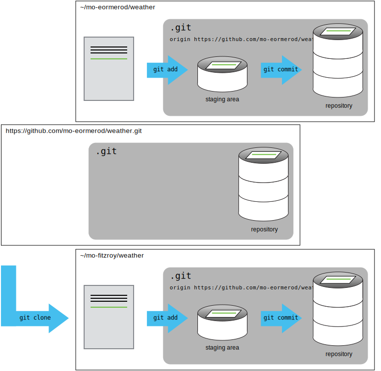
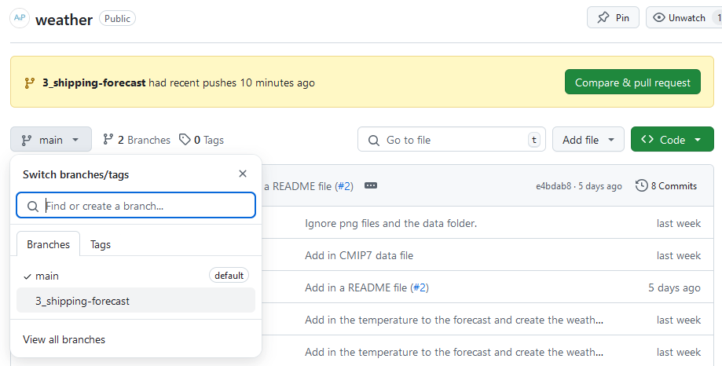
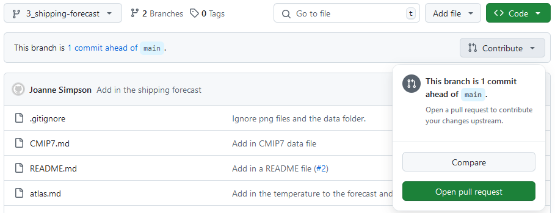

::::::::::::::::::::::::::::::::::::::: objectives

- Use the feature branch model to collaborate.
- Clone a remote repository.

::::::::::::::::::::::::::::::::::::::::::::::::::

:::::::::::::::::::::::::::::::::::::::: questions

- How can I use version control to collaborate with other people?

::::::::::::::::::::::::::::::::::::::::::::::::::

In this episode we will use the Feature Branch model
to contribute to each others repositories.

You will need to get into pairs.
One person will be the "Owner" and the other
will be the "Collaborator".
The goal is for the Collaborator to add changes into
the Owner's repository.
We will switch roles at the end, so both persons will
play Owner and Collaborator.

While working together be sure to share what you
are doing with your partner.

:::::::::::::::::::::::::::::::::::::::::  callout

## Practicing By Yourself

If you're working through this lesson on your own, you can carry on by opening
a second terminal window.
This window will represent your partner, working on another computer. You
won't need to give anyone access on GitHub, because both 'partners' are you.

::::::::::::::::::::::::::::::::::::::::::::::::::

## Repository Access

The Owner needs to give the Collaborator access.
In your repository page on GitHub, click the "Settings"
button on the right, select "Collaborators",
click "Add people", and
then enter your partner's username.

{alt='A screenshot of the GitHub Collaborators settings page, which is accessed by clicking "Settings" then "Collaborators"'}

To accept access to the Owner's repo, the Collaborator
needs to go to [https://github.com/notifications](https://github.com/notifications)
or check for an email notification.
Once there they can accept access to the Owner's repo.

## Cloning a Repo

Next, the Collaborator needs to download a copy of the
Owner's repository to their machine.
This is called "cloning a repo".

The Collaborator doesn't want to overwrite their own version of `climate`, so
needs to clone the Owner's repository to a different location than their own
repository with the same name.

To clone the Owner's repository into their `Desktop` folder, the Collaborator enters:

```bash
$ git clone git@github.com:mo-eormerod/weather.git ~/Desktop/mo-eormerod-weather
```

Replace 'mo-eormerod' with the Owner's username.

If you choose to clone without the clone path
(`~/Desktop/mo-eormerod-weather`) specified at the end,
you will clone inside your own weather folder!
Make sure to navigate to the `Desktop` folder first.

{alt='A diagram showing that "git clone" can create a copy of a remote GitHub repository, allowing a second person to create their own local repository that they can make changes to.'}

## Feature Branches

The Collaborator can now make a change in their clone of the Owner's repository.
We will use a feature branch in the same way as we've been doing before:

```bash
$ cd ~/Desktop/mo-eormerod-weather
$ git switch -c 3_shipping-forecast
```

```output
Switched to branch '3_shipping-forecast'
```

Notice the name of the branch is prefixed by the
number `3`. This is the Issue number of the Issue the Owner
created on their repository.
Your team may choose a different naming convention such
as prefixing the branch name by `feature`, `bug` etc.

```bash
$ nano shipping-forecast.md
$ cat shipping-forecast.md
```

```output
New high expected Dover 1028 by 0600 tomorrow.
Low Trafalgar 1013 losing its identity
```

```bash
$ git add shipping-forecast.md
$ git commit -m "Add in the shipping forecast"
```

```output
[3_shipping-forecast 17a1454] Add in the shipping forecast
 1 file changed, 2 insertions(+)
 create mode 100644 shipping-forecast.md
```

Then push the change to the *Owner's repository* on GitHub:

```bash
$ git push
```

```output
Enumerating objects: 4, done.
Counting objects: 100% (4/4), done.
Delta compression using up to 4 threads
Compressing objects: 100% (3/3), done.
Writing objects: 100% (3/3), 382 bytes | 191.00 KiB/s, done.
Total 3 (delta 1), reused 0 (delta 0), pack-reused 0
remote: Resolving deltas: 100% (1/1), completed with 1 local object.
remote: 
remote: Create a pull request for '3_shipping-forecast' on GitHub by visiting:
remote:      https://github.com/mo-eormerod/weather/pull/new/3_shipping-forecast
remote: 
To github.com:mo-eormerod/weather.git
 * [new branch]      3_shipping-forecast -> 3_shipping-forecast
branch '3_shipping-forecast' set up to track 'origin/3_shipping-forecast'.
```

Note that we didn't have to create a remote called `origin`: Git uses this
name by default when we clone a repository.  (This is why `origin` was a
sensible choice earlier when we were setting up remotes by hand.)

Take a look at the Owner's repository on GitHub again, and you should be
able to see the `3_shipping-forecast` branch and this
new commit made by the Collaborator.
You may need to refresh your browser to see the new commit.

:::::::::::::::::::::::::::::::::::::::::  spoiler

## Some more about remotes

In this episode and the previous one, our local repository has had
a single "remote", called `origin`. A remote is a copy of the repository
that is hosted somewhere else, that we can push to and pull from, and
there's no reason that you have to work with only one. For example,
on some large projects you might have your own copy in your own GitHub
account (you'd probably call this `origin`) and also the main "upstream"
project repository (let's call this `upstream` for the sake of examples).
You would pull from `upstream` from time to
time to get the latest updates that other people have committed.

Remember that the name you give to a remote only exists locally. It's
an alias that you choose - whether `origin`, or `upstream`, or `mo-eormerod` -
and not something intrinsic to the remote repository.

The `git remote` family of commands is used to set up and alter the remotes
associated with a repository. Here are some of the most useful ones:

- `git remote -v` lists all the remotes that are configured (we already used
  this in the last episode)
- `git remote add [name] [url]` is used to add a new remote
- `git remote remove [name]` removes a remote. Note that it doesn't affect the
  remote repository at all - it just removes the link to it from the local repo.
- `git remote set-url [name] [newurl]` changes the URL that is associated
  with the remote. This is useful if it has moved, e.g. to a different GitHub
  account, or from GitHub to a different hosting service. Or, if we made a typo when
  adding it!
- `git remote rename [oldname] [newname]` changes the local alias by which a remote
  is known - its name. For example, one could use this to change `upstream` to `mo-eormerod`.
  

::::::::::::::::::::::::::::::::::::::::::::::::::

## Open a PR

In the git-novice lesson you practised opening a
[pull request](https://www.astropython.com/git-novice/10-pull-requests.html).

You should see a notification appear on GitHub telling you the
`3_shipping-forecast` branch had recent pushes.
The Collaborator should click on the green **Compare & pull request** button to
open the PR.

If you don't see this notification click on the branches dropdown
, the button showing `main`,
and click on the `3_shipping-forecast` branch.

{alt='A screenshot of the GitHub weather repository showing the branch selection dropdown.'}

You should now see the Code view for the `3_shipping-forecast` branch
and a **Contribute** button.
Click on the **Contribute** button and select the green
**Open pull request** option.

{alt='A screenshot of the GitHub weather repository showing code view for the 3_shipping-forecast branch. The Contribute dropdown is expanded to show the Open pull request option.'}

You may have noticed when running `git push`
on the `3_shipping-forecast` branch for the first time
the output contained:

```output
remote: Create a pull request for '3_shipping-forecast' on GitHub by visiting:
remote:      https://github.com/mo-eormerod/weather/pull/new/3_shipping-forecast
```

You could have also followed this link to create a new PR.
We recommend you always open a **draft** PR after your first push.
This gives you access to a diff of your changes
against the target branch (usually `main`).
When the changes are ready for review you can mark the PR
as **Ready for review**.

### Automatically closing Issues via PRs

This PR adds in the shipping forecast which we have an open Issue for.
A PR can automatically close an Issue when it is merged into `main`.
To use this GitHub functionality add:

```md
Closes #3
```

To the first comment of the PR,
change `3` to the Issue number of the Issue the Owner
created on their repository.
The [GitHub Documentation](https://docs.github.com/en/issues/tracking-your-work-with-issues/using-issues/linking-a-pull-request-to-an-issue) has more information
on linking PRs to Issues.

In the next episode we will look at how these changes
are reviewed and merged back into `main` in more detail.

:::::::::::::::::::::::::::::::::::::::: keypoints

- Add collaborators to your repository by going to the repository **Settings** then the **Collaborators** tab.
- Cloning a repository gives you a local copy of the repository:
  `git clone <repository> <directory>`
- Automatically close Issues when a PR is merged by adding
  a `Closes #<Issue number>` line to the first comment in the PR.

::::::::::::::::::::::::::::::::::::::::::::::::::
