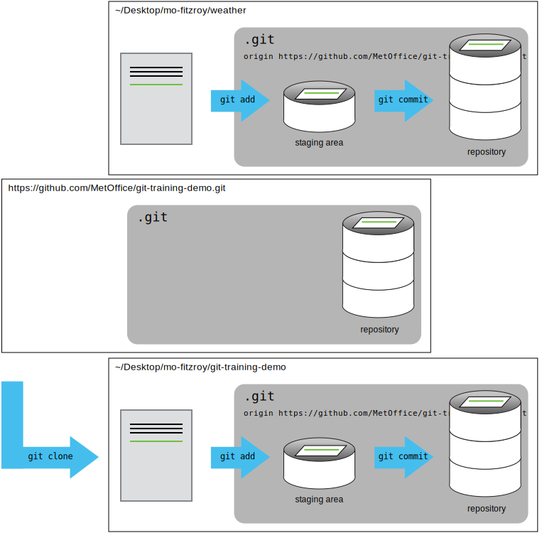
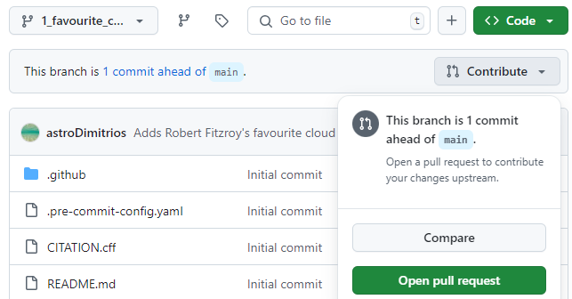

::::::::::::::::::::::::::::::::::::::: objectives

- Use the feature branch model to collaborate.
- Clone a remote repository.

::::::::::::::::::::::::::::::::::::::::::::::::::

:::::::::::::::::::::::::::::::::::::::: questions

- How can I use version control to collaborate with other people?
- What are Pull Request templates?

::::::::::::::::::::::::::::::::::::::::::::::::::

In this episode we will use the Feature Branch model
to contribute to the `git-training-demo` repository.

You will need to get into pairs
so that you can review each others code changes.
Your instructor may have already paired you
with another learner.

## Cloning a Repository

You will both need to download a copy of the `git-training-demo` repository.
This is called "cloning a repository".

```bash
$ cd ~/Desktop
```

```bash
$ git clone git@github.com:metoffice/git-training-demo.git
```

Make sure to navigate to the `Desktop` folder first.

{alt='A diagram showing that "git clone" can create a copy of a remote GitHub repository, allowing a second person to create their own local repository that they can make changes to.'}

## Feature Branches

You can now make changes to the `git-training-demo` repository
using your clone.
We will use a feature branch to develop our change on:

```bash
$ cd git-training-demo
$ git switch -c 1_favourite_cloud
```

```output
Switched to branch '1_favourite_cloud'
```

Notice the name of the branch is prefixed by the
number `1`. This is the Issue number of the Issue
you created in Episode 2 Issues.
Your team may choose a different naming convention such
as prefixing the branch name by `feature`, `bug` etc.

Add in a new file `cloud-mo-fitzroy.md`,
replace `mo-fitzroy` with your username:

```bash
$ nano cloud-mo-fitzroy.md
$ cat cloud-mo-fitzroy.md
```

```output
# My Favourite Cloud

Light and fluffy cumulus.
```

Add and commit your changes:

```bash
$ git add cloud-mo-fitzroy.md
$ git commit -m "Adds Robert Fitzroy's favourite cloud"
```

```output
[1_favourite_cloud b7f26e6] Adds Robert Fitzroy's favourite cloud
 1 file changed, 3 insertions(+)
 create mode 100644 cloud-mo-fitzroy.md
```

Then push the changes to GitHub:

```bash
$ git push
```

```output
Enumerating objects: 4, done.
Counting objects: 100% (4/4), done.
Delta compression using up to 4 threads
Compressing objects: 100% (2/2), done.
Writing objects: 100% (3/3), 357 bytes | 178.00 KiB/s, done.
Total 3 (delta 1), reused 0 (delta 0), pack-reused 0
remote: Resolving deltas: 100% (1/1), completed with 1 local object.
remote: 
remote: Create a pull request for '1_favourite_cloud' on GitHub by visiting:
remote:      https://github.com/MetOffice/git-training-demo/pull/new/1_favourite_cloud
remote: 
To github.com:metoffice/git-training-demo.git
 * [new branch]      1_favourite_cloud -> 1_favourite_cloud
branch '1_favourite_cloud' set up to track 'origin/1_favourite_cloud'.
```

Note that we didn't have to create a remote called `origin`: Git uses this
name by default when we clone a repository.
This is why `origin` was a sensible choice
in the git-novice lesson when we were setting up remotes by hand.

Take a look at the repository on GitHub again, and you should be
able to see the `1_favourite_cloud` branch.
You may need to refresh your browser to see the new branch.

:::::::::::::::::::::::::::::::::::::::::  spoiler

## fatal: no upstream branch

If you see a message similar to the following:

```output
fatal: The current branch 1_favourite_cloud has no upstream branch.
To push the current branch and set the remote as upstream, use

    git push --set-upstream origin 1_favourite_cloud

To have this happen automatically for branches without a tracking
upstream, see 'push.autoSetupRemote' in 'git help config'.
```

You will need to set the name of the upstream GitHub branch using
the recommended `git push` command.

You can get git to automatically set the upstream branch.
This avoids having to run git push with the --set-upstream flag
the first time you push from a new branch.

Change your git config using:

```bash
$ git config --global push.autoSetupRemote true
```

::::::::::::::::::::::::::::::::::::::::::::::::::

:::::::::::::::::::::::::::::::::::::::::  spoiler

## Some more about remotes

In this episode and in the git-novice lesson, our local repository only had
a single "remote", called `origin`. A remote is a copy of the repository
that is hosted somewhere else, that we can push to and pull from, and
there's no reason that you have to work with only one. For example,
on some large projects you might have your own copy in your own GitHub
account (you'd probably call this `origin`) and also the main "upstream"
project repository (let's call this `upstream` for the sake of examples).
You would pull from `upstream` from time to
time to get the latest updates that other people have committed.
We will practice using an `upstream` repository later in the forking model.

Remember that the name you give to a remote only exists locally. It's
an alias that you choose - whether `origin`, or `upstream`, or `mo-fitzroy` -
and not something intrinsic to the remote repository.

The `git remote` family of commands is used to set up and alter the remotes
associated with a repository. Here are some of the most useful ones:

- `git remote -v` lists all the remotes that are configured (we already used
  this in the last episode)
- `git remote add [name] [url]` is used to add a new remote
- `git remote remove [name]` removes a remote. Note that it doesn't affect the
  remote repository at all - it just removes the link to it from the local repo.
- `git remote set-url [name] [newurl]` changes the URL that is associated
  with the remote. This is useful if it has moved, e.g. to a different GitHub
  account, or from GitHub to a different hosting service. Or, if we made a typo when
  adding it!
- `git remote rename [oldname] [newname]` changes the local alias by which a remote
  is known - its name. For example, one could use this to change `upstream` to `mo-fitzroy`.
  

::::::::::::::::::::::::::::::::::::::::::::::::::

## Open a PR

In the git-novice lesson you practised opening a
[pull request](https://www.astropython.com/git-novice/10-pull-requests.html).

You should see a notification appear on GitHub telling you the
`1_favourite_cloud` branch had recent pushes.
The Collaborator should click on the green **Compare & pull request** button to
open the PR.

If you don't see this notification click on the branches dropdown,
the button showing `main`,
and click on the `1_favourite_cloud` branch.

{alt='A screenshot of the GitHub weather repository showing the branch selection dropdown.'}

You should now see the Code view for the `1_favourite_cloud` branch
and a **Contribute** button.
Click on the **Contribute** button and select the green
**Open pull request** option.

{alt='A screenshot of the GitHub weather repository showing code view for the 1_favourite_cloud branch. The Contribute dropdown is expanded to show the Open pull request option.'}

You may have noticed when running `git push`
on the `1_favourite_cloud` branch for the first time
the output contained:

```output
remote: Create a pull request for '1_favourite_cloud' on GitHub by visiting:
remote:      https://github.com/MetOffice/git-training-demo/pull/new/1_favourite_cloud
```

You could have also followed this link to create a new PR.
We recommend you always open a **draft** PR after your first push.
This gives you access to a diff of your changes
against the target branch (usually `main`).
When the changes are ready for review you can mark the PR
as **Ready for review**.

## Pull Request Templates

Notice the description has filled with a template.
Just like this repository used Issue templates it
also uses a [PR template](https://docs.github.com/en/communities/using-templates-to-encourage-useful-issues-and-pull-requests/creating-a-pull-request-template-for-your-repository).

This template has a checklist that needs to be
completed before opening the PR[^pr-checklist].
It also has checklists for science and code review.
In the description scroll down to the checklists
which look like this:

```md
- [ ] I have read `CONTRIBUTING.md` and added my name as a Code Contributor.
```

Some open source projects require you to add your name
to a list of contributors.
We will do this later so for now mark the task as complete.
Replace the space in the square checkbox brackets with an `x`
to mark the task as complete:

```md
- [x] I have read `CONTRIBUTING.md` and added my name as a Code Contributor.
```

Now when you open the PR it should look something like this:

{alt='A screenshot of a users  pull request from their fork back to the upstream git-training-demo repository.'}

This image shows PR number `#8`.
This PR will close/fix Issue number `#7` (the top left arrow).
You can request a review on the top right.
Some repositories will be set up to automatically assign
a reviewer based on how many reviews each team member
currently has open[^auto-assign-pr-review].
The bottom arrow shows the checklist items we marked as complete.

At the bottom of your PR you can see that a review is required
before merging.
All checks have passed, this repository has automatic checks
for trailing whitespace, accidentally adding large files etc.
More information can be found in the optional episode on
[pre-commit hooks](./09-pre-commit.md).

::: caution

## Help: Some checks have failed

If your now open Pull Request says some checks have failed
this is because your changes did not pass the automatic
pre-commit checks.

Click on the **Details** link next to the failed test
and fix your code on your local repository.
Commit and then push this fix to GitHub.
Your PR will automatically update and re-run the tests,
you may need to refresh the page.

:::

### Automatically closing Issues via PRs

A PR can automatically close an Issue when it is merged into `main`.
To use this GitHub functionality
replace the templates `Fixes <#ISSUE_NUMBER>` line with either:

```md
Closes #1
```

or

```md
Fixes #1
```

Make sure you change `1` to your Issue number.
The [GitHub Documentation](https://docs.github.com/en/issues/tracking-your-work-with-issues/using-issues/linking-a-pull-request-to-an-issue) has more information
on linking PRs to Issues.

In the next episode we will look at how these changes
are reviewed and merged back into `main` in more detail.

:::::::::::::::::::::::::::::::::::::::  challenge

## Assign a Reviewer

Assign the other learner in your pair as the reviewer
by clicking on the cog to the right of the Reviewers section.

On the right hand side of the PR you can also:

1. Assign yourself to the PR.
2. Add labels to the PR.
3. Add the PR to a Project by clicking on the cog
next to the Projects section. (If you don't see a project
related to the training you might not have been granted permissions, 
ask your instructors for help)
4. Assign the PR to a milestone.

::::::::::::::::::::::::::::::::::::::::::::::::::

:::::::::::::::::::::::::::::::::::::::: keypoints

- Cloning a repository gives you a local copy of the repository:
  `git clone <repository> <directory>`
- Automatically close Issues when a PR is merged by adding
  a `Closes #<Issue number>` line to the first comment in the PR.
- Pull Request templates provide template text
  for the first comment for new Issues of various types,
  and Pull Requests.
  They can auto-label Issues and encourage collaborators
  to give plenty of detail.

::::::::::::::::::::::::::::::::::::::::::::::::::

[^pr-checklist]: You can also open a draft PR and then edit the top
comment to mark the checklist tasks as completed.
[^auto-assign-pr-review]: The [GitHub Documentation](https://docs.github.com/en/organizations/organizing-members-into-teams/managing-code-review-settings-for-your-team) has more information on automatically assigning reviewers.
