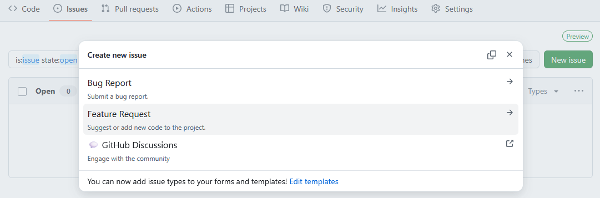

::::::::::::::::::::::::::::::::::::::: objectives

- Create a fork of a repository.
- Contribute to the upstream repository using the fork.

::::::::::::::::::::::::::::::::::::::::::::::::::

:::::::::::::::::::::::::::::::::::::::: questions

- What is a fork?
- What are Issue and Pull Request templates?

::::::::::::::::::::::::::::::::::::::::::::::::::

Most open source projects require new collaborators to
contribute via their personal **fork** of the repository.
A fork is simply a copy of the repository that you make
on the server, in our GitHub, side.
This avoids having to give repository permissions to
every single collaborator.

In this episode we will create a fork and contribute
a change to the main GitHub repository using the
feature branch model we have been practising.

Your instructor will give you a link to the `git-training-demo`
repository you will be forking.
This is the **upstream** repository for you fork.

## Open an Issue

Remember we track our work with Issues.
Open an Issue on the `git-training-demo` repository 
to add a file stating your favourite cloud type.

Navigate to the **Issues** tab:

{alt='A screenshot of the git-training-demo repository showing the Issues view.'}

This repositories Issue tab looks different.
It uses [Issue templates](https://docs.github.com/en/communities/using-templates-to-encourage-useful-issues-and-pull-requests/configuring-issue-templates-for-your-repository)
to provide templates for bugs and feature requests.
Click on the green **Get started** button next to the
**Feature request** option:

{alt='A screenshot of the git-training-demo repository showing an Issue being opened. The template has automatically added text to the description and labelled the Issue as an enhancement.'}

You can see the Issue has text in the description already.
This is from the template which provides a consistent
structure to the Issues on this repo.
The template has also added the `enhancement` label for you.

Add in a clear title such as
"Add mo-fitzroy's favourite cloud type",
replace 'mo-fitzroy' with your GitHub username.
Click **Submit new issue**.

::::::::::::::::::::::::::::::::::::: instructor

It's a good idea to remind learners that
images can be dropped straight into the
Issue description.
An image of a cloud should do!

::::::::::::::::::::::::::::::::::::::::::::::::

### Projects, milestones, and labels

Your instructor has set up a Project and some custom milestones
for you to add to your Issue.

- [Labels](https://docs.github.com/en/issues/using-labels-and-milestones-to-track-work/managing-labels)
  help you classify Issues and PRs.
- [Milestones](https://docs.github.com/en/issues/using-labels-and-milestones-to-track-work/about-milestones)
  group Issues and PRs, tracking their progress towards a common milestone automatically.
- [Projects](https://docs.github.com/en/issues/planning-and-tracking-with-projects/learning-about-projects/about-projects)
  are a tool for planning and tracking work via GitHub.
  Multiple repositories can be linked to a single project.
  Projects can have multiple views depending on your needs;
  some have kanban boards and gantt charts, others separate out
  an individual colleagues Issues to avoid clutter.

## Create a Fork

On the repository Code tab click on the **Fork** dropdown arrow
and then the **+ Create a new fork** button:

{alt='A screenshot of the git-training-demo repository showing the fork dropdown with the Create a new fork button.'}

GitHub will take you to the **Create a new fork** page.
There is no need to edit anything on this page.
Click on the green **Create fork** button:

{alt='A screenshot of the GitHub Create a new fork page.'}

You should now see your repository fork.
The repository is marked as a fork by the fork symbol
next to the repository organisation and name in the top
navigation bar.
Under the main repository name you can see a link to the
repository we forked from.
The notification at the bottom of the screenshot shows
whether your forks `main` branch is up to date with the
upstream repository.
If you have commits on your fork not present upstream
you can **Contribute** your changes upstream via a PR.
If your fork is behind the upstream repository
you can **Sync fork** to pull in changes from the
upstream repository.

{alt='A screenshot of a fork of the git-training-demo repository. The repository is marked as a fork by the fork symbol next to the repository name and the link to the original repository under the repository name.'}

## Make Changes

You will be using this fork to make changes using
the feature branch model from the previous episodes.
Clone your fork, replace `mo-fitzroy` with your username:

```bash
$ git clone git@github.com:mo-fitzroy/git-training-demo.git
```

```output
Cloning into 'git-training-demo'...
remote: Enumerating objects: 47, done.
remote: Counting objects: 100% (47/47), done.
remote: Compressing objects: 100% (44/44), done.
remote: Total 47 (delta 3), reused 0 (delta 0), pack-reused 0 (from 0)
Receiving objects: 100% (47/47), 17.07 KiB | 1.07 MiB/s, done.
Resolving deltas: 100% (3/3), done.
```

Create your feature branch:

```bash
$ cd git-training-demo
$ git switch -c 1_add-favourite-cloud
```

```output
Switched to a new branch '1_add-favourite-cloud'
```

::: callout

## Branch Names

Some colleagues prefix the branch name
with the Issue number as shown above.
This helps remind you what the branch is for!

:::

Add in a new file `cloud-mo-fitzroy.md`,
replace `mo-fitzroy` with your username:

```bash
$ nano cloud-mo-fitzroy.md
$ cat cloud-mo-fitzroy.md
```

```output
# My Favourite Cloud

Light and fluffy cumulus.
```

Add and commit your changes:

```bash
$ git add cloud-mo-fitzroy.md
$ git commit -m "Adds Robert Fitzroy's favourite cloud"
```
```output
[1_add-favourite-cloud a3c5e13] "Adds Robert Fitzroy's favourite cloud" 
 1 file changed, 3 insertions(+)
 create mode 100644 cloud-mo-fitzroy.md
```

Push your changes to your GitHub fork:

```bash
$ git push
```

```output
Enumerating objects: 5, done.
Counting objects: 100% (5/5), done.
Delta compression using up to 4 threads
Compressing objects: 100% (3/3), done.
Writing objects: 100% (3/3), 354 bytes | 354.00 KiB/s, done.
Total 3 (delta 2), reused 0 (delta 0), pack-reused 0
remote: Resolving deltas: 100% (2/2), completed with 2 local objects.
To github.com:mo-fitzroy/git-training-demo.git
   f87bb5c..a3c5e13  1_add-favourite-cloud -> 1_add-favourite-cloud
branch '1_add-favourite-cloud' set up to track 'origin/1_add-favourite-cloud'.
```

## Open a Pull Request

Head back to your fork on GitHub and open a PR to
contribute your changes upstream to the main
`git-training-demo` repository.

{alt='A screenshot of a user opening a pull request from their fork back to the upstream git-training-demo repository. The description has been autofilled with the pull request template contents.'}

Notice the description has filled with a template.
Just like this repository used Issue templates it
also uses a [PR template](https://docs.github.com/en/communities/using-templates-to-encourage-useful-issues-and-pull-requests/creating-a-pull-request-template-for-your-repository).

Check the Issue you opened earlier for the Issue number.
`mo-fitzroy` checks theirs and it was Issue `#1`.
So he changes the line `Fixes <#ISSUE_NUMBER>` to `Fixes #1`.
This will automatically close Issue 1 when the PR is merged.
We use the keyword `Fixes` here instead of the `Closes`
keyword we used before because this PR comes from a fork[^link-issue-pr].

This template has a checklist that needs to be
completed before opening the PR[^pr-checklist].
It also has checklists for science and code review.
In the description scroll down to the checklists
which look like this:

```md
- [ ] I have read `CONTRIBUTING.md` and added my name as a Code Contributor.
```

Some open source projects require you to add your name
to a list of contributors.
We will do this later so for now mark the task as complete.
Replace the space in the square checkbox brackets with an `x`
to mark the task as complete:

```md
- [x] I have read `CONTRIBUTING.md` and added my name as a Code Contributor.
```

Now when you open the PR it should look something like this:

{alt='A screenshot of a users  pull request from their fork back to the upstream git-training-demo repository.'}

This image shows PR number `#8`.
This PR will close/fix Issue number `#7` (the top left arrow).
You can request a review on the top right.
Some repositories will be set up to automatically assign
a reviewer based on how many reviews each team member
currently has open[^auto-assign-pr-review].
The bottom arrow shows the checklist items we marked as complete.

At the bottom of your PR you can see that a review is required
before merging.
All checks have passed, this repository has automatic checks
for trailing whitespace, accidentally adding large files etc.
More information can be found in the optional episode on
[pre-commit hooks](./09-pre-commit.md).

The PR will now need to be approved and merged by your instructors.

::::::::::::::::::::::::::::::::::::: instructor

Take a break here!
This will give you and your co-instructor time
to approve, and squash and merge the PRs.

::::::::::::::::::::::::::::::::::::::::::::::::

## Updating a Fork

Our fork is now behind the main upstream repository
by one commit.
We are going to update our fork.
First we need to set the correct upstream remote in git.

Switch back to your forks `main` branch:

```bash
$ git switch main
```

Now run:

```bash
$ git remote -v
```

```output
origin	git@github.com:mo-fitzroy/git-training-demo.git (fetch)
origin	git@github.com:mo-fitzroy/git-training-demo.git (push)
```

This shows the GitHub remote links for our fork.
To set the upstream remote we can run:

```bash
$ git remote add upstream git@github.com:MetOffice/git-training-demo.git
$ git remote -v
```

```output
origin	git@github.com:mo-fitzroy/git-training-demo.git (fetch)
origin	git@github.com:mo-fitzroy/git-training-demo.git (push)
upstream	git@github.com:MetOffice/git-training-demo.git (fetch)
upstream	git@github.com:MetOffice/git-training-demo.git (push)
```

Now git knows about the forks upstream repository.
We can fetch the changes to the upstream repository by running:

```bash
$ git fetch upstream
```

```output
remote: Enumerating objects: 6, done.
remote: Counting objects: 100% (6/6), done.
remote: Compressing objects: 100% (2/2), done.
remote: Total 4 (delta 3), reused 2 (delta 2), pack-reused 0 (from 0)
Unpacking objects: 100% (4/4), 1.10 KiB | 41.00 KiB/s, done.
From github.com:MetOffice/git-training-demo
 * [new branch]      main                   -> upstream/main
```

We now have access to the `upstream/main` branch.
To merge in the changes on `upstream/main`:

```bash
$ git merge upstream/main
```

And push:

```bash
$ git push
```

```output
Total 0 (delta 0), reused 0 (delta 0), pack-reused 0
To github.com:mo-fitzroy/git-training-demo.git
   f87bb5c..90808ab  main -> main
```

Your forks `main` branch is now up to date with the
main `git-training-demo` repositories `main` branch.

::: callout

## Sync via GitHub

This is equivalent of syncing your fork via the GitHub banner
shown earlier:

{alt='A screenshot of a users repository showing just the banner announcing the repository is a fork and that is up to date with the upstream repository.'}

If your fork is **behind** the upstream repository
GitHub will alert you on the banner.
You can use the **Sync fork** button to update your fork like we did above.
After syncing your fork this way you only need to run `git pull`
on your local `main` branch.

:::

:::::::::::::::::::::::::::::::::::::::: keypoints

- A fork is a server side (in our case GitHub) copy
  of the repository.
- Forks allow collaborators to contribute to the main
  repository without being given write permissions.
- Issue and Pull Request templates provide template text
  for the first comment for new Issues of various types,
  and Pull Requests.
  They can auto-label Issues and encourage collaborators
  to give plenty of detail.

::::::::::::::::::::::::::::::::::::::::::::::::::

[^link-issue-pr]: The [GitHub Documentation](https://docs.github.com/en/issues/tracking-your-work-with-issues/using-issues/linking-a-pull-request-to-an-issue) has more information
on linking PRs to Issues.
[^pr-checklist]: You can also open a draft PR and then edit the top
comment to mark the checklist tasks as completed.
[^auto-assign-pr-review]: The [GitHub Documentation](https://docs.github.com/en/organizations/organizing-members-into-teams/managing-code-review-settings-for-your-team) has more information on automatically assigning reviewers.
