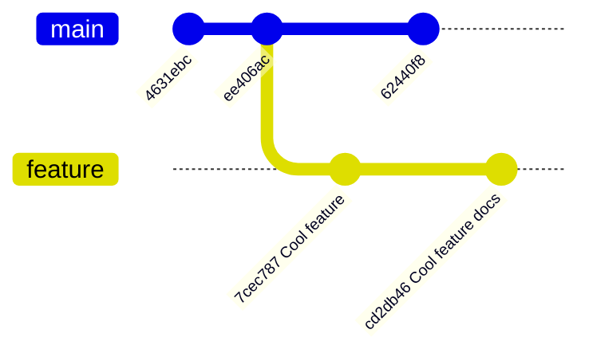
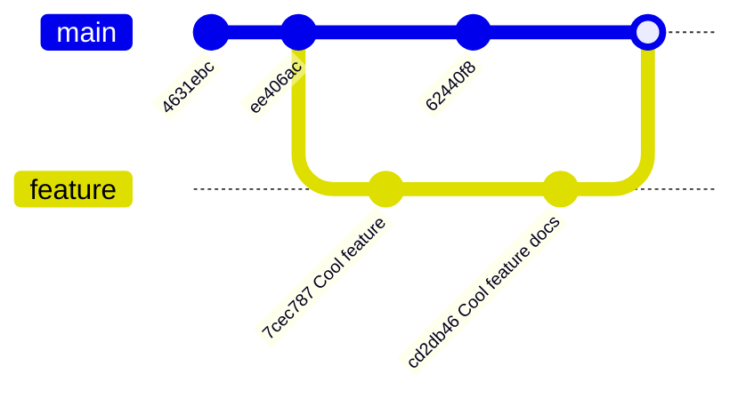
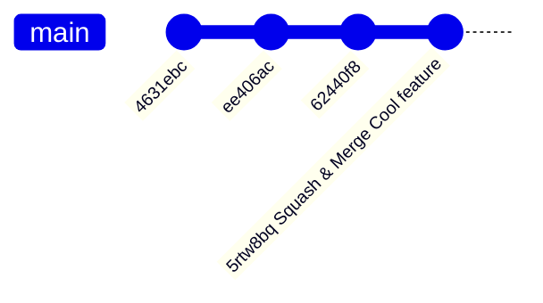
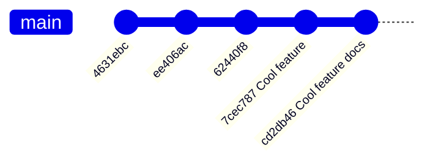

::::::::::::::::::::::::::::::::::::::: objectives

- Visualise our git history.
- Learn the difference between merge, squash merge, and rebase.

::::::::::::::::::::::::::::::::::::::::::::::::::

:::::::::::::::::::::::::::::::::::::::: questions

- Why is a linear history useful?

::::::::::::::::::::::::::::::::::::::::::::::::::

The history of your repository is simply
its commits.
A more linear history is easier to understand
and can be helpful when using certain git
commands to explore your history.

Your Git history will look different depending on the merge
strategy you use when merging PRs
and whether you allow merging `main` into a feature branch.
It's up to you and your team to decide which strategy is
best for your repository.

::: spoiler

## Viewing History

In the [Introduction to Version Control
with Git](https://www.astropython.com/git-novice/05-history.html) lesson you learnt that we can use the
`git log` command to view the commit history
of our repository.

We can use certain flags with `git log` to better
visualise the history in graph form:

```bash
$ git log --decorate --oneline --graph
```

The [GitHub Documentation for git log](https://git-scm.com/docs/git-log) has information on all the available flags.
Some useful examples of `git log` alias's  and flags can be found on
[this Stackoverflow comment](https://stackoverflow.com/questions/1838873/visualizing-branch-topology-in-git/34467298#34467298).

:::

::: callout

### IDE Git History Extensions

Your IDE may have extensions which render your
git history as easy to read graphs.
If you use VSCode we recommend the [Git Graph extension](https://marketplace.visualstudio.com/items?itemName=mhutchie.git-graph).

:::

## Merge Options

When you open a PR you are given
three options for merging your feature
branch into `main`.
We will now explore how each merging method
affects the history of your repository.
In all the examples below we start with the same git history.

## Merge

Starting with:



Using merge creates a merge commit joining
the two branches:



This results in a non-linear history which
can be hard to navigate.
You can avoid this non-linear history by rebasing
your `feature` branch before you merge.
Rebasing a branch before you submit a PR for
review is covered in the next episode.

Some teams choose to use Merge because it
keeps all the individual commits that made
up your change so more accurately represents
the history of your repository.

## Squash and Merge

Starting with:


Squashing before merging squashes all the
commits on the feature branch into one
commit which is then merged onto main:



The last commit on main `5rtw8bq Squash & Merge Cool feature`
is the two feature branch commits squashed
together into a new one.

Here the history is linear but all our commits
have been squashed into one.
If you have a very large branch with many commits
you might not want to squash them all into one commit.
Squashing in this case will make bug hunting harder.
Remember you should try and break work down into
small pieces so you avoid huge branches.

## Rebase

Starting with:


Rebase re-writes your git history removing
the `feature` branch commits from the `feature`
branch and adding them to `main`:



::: caution

### Rebase Re-Writes History

Rebasing re-writes your git history.
Do **NOT** rebase shared branches such as `main`.

:::

Since rebase re-writes your history you have to force
push to the GitHub remote to override your remotes history.
The history in this case is linear and retains all
the commits which makes it easier to search for
a commit that introduced a bug.
Rebasing a feature branch can be difficult / impossible if you have
merged `main` into your feature branch to update it
with the latest changes or resolve conflicts.
You should choose to move your feature branch to the `HEAD` of
`main` using rebasing instead.

Your team will decide what approach is right
for your project.

:::::::::::::::::::::::::::::::::::::::: keypoints

- `git log --decorate --oneline --graph` lets you visualise your repository history in graph form.
- There are three options for merging your feature
branch into `main`.
- merge: creates a merge commit and results in a non-linear history unless you first rebase your feature branch.
- squash and merge: squashes all your feature branch commits into one merge commit on `main`. Your history is linear.
- rebase: re-writes your git history so that all the feature branch commits are now on `main`. Your history is linear.

::::::::::::::::::::::::::::::::::::::::::::::::::
