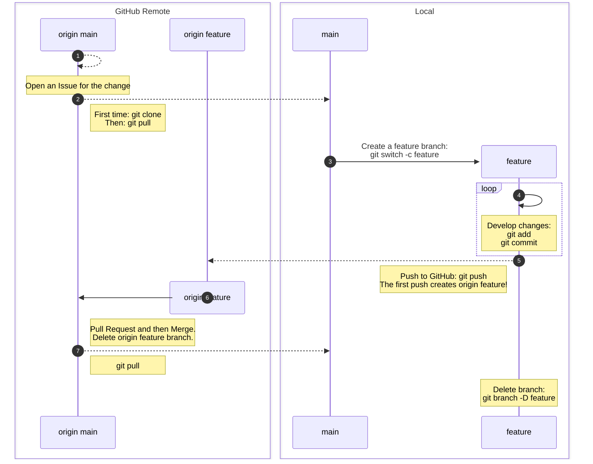

You've now used the Feature Branch model to:

1. Open an Issue describing the feature or bug
2. Clone a repository
3. Create a branch to develop your changes on
4. Make changes to your working copy
5. Open a Pull Request
6. Respond to review
7. Update your local copy and tidy up your branches

Take a break - get up and move about.
