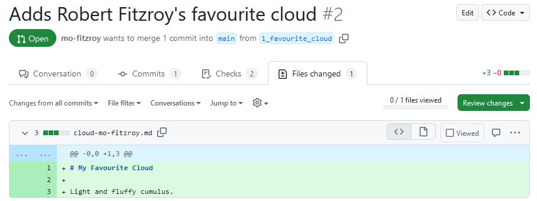
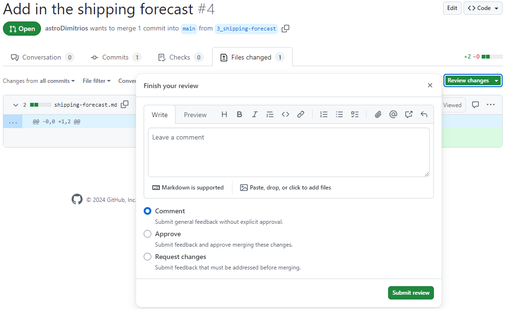
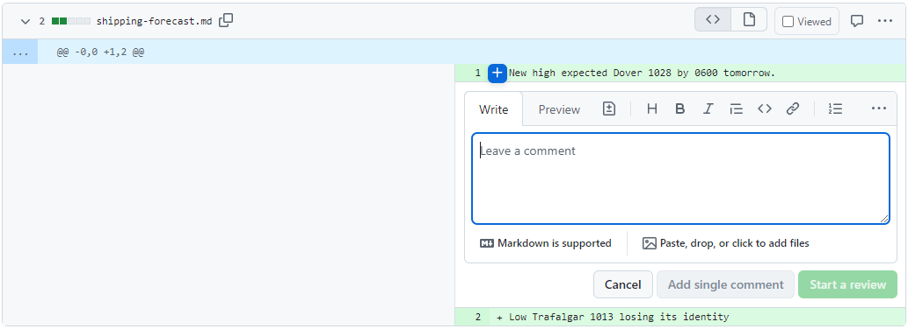
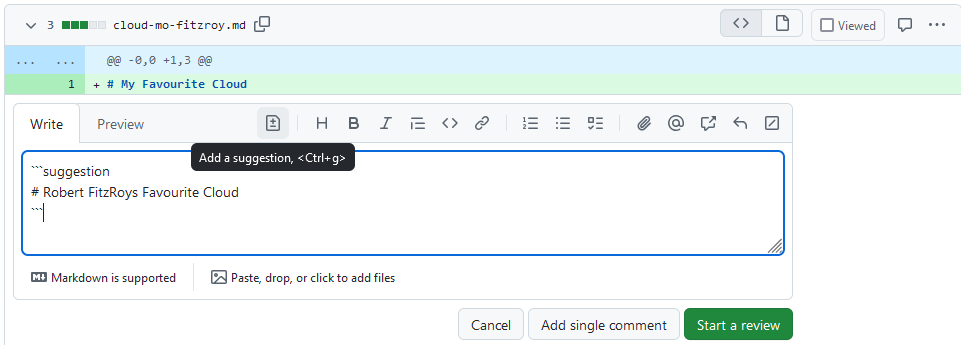
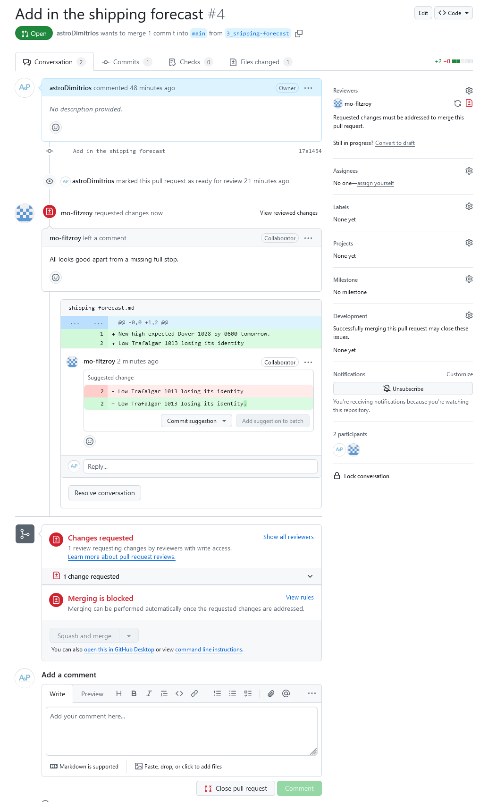
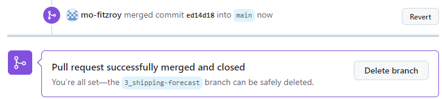

::::::::::::::::::::::::::::::::::::::: objectives

- Review changes made by collaborators.
- Respond to a review.

::::::::::::::::::::::::::::::::::::::::::::::::::

:::::::::::::::::::::::::::::::::::::::: questions

- How do I see a diff of the changes?
- How can I make inline comments or suggested changes?

::::::::::::::::::::::::::::::::::::::::::::::::::

In this section we will explore how to properly review
code and suggest changes if necessary.
We will continue to work in pairs.
The Owner should navigate back to their own `weather` repository.
You should see an open PR from your Collaborator.

## Reviewing Changes

As the Owner make sure you are on the PR your Collaborator has opened
on your repository.

You can add general science and code review comments
in the **Conversation** tab.
To review specific files go to the **Files changed** tab:

{alt='A screenshot of a PR showing the diff in the Files changed tab. The diff is shown with Split view.'}

This tab shows a diff (difference) between your feature branch,
`3_shipping-forecast`, and the target branch, `main`.
Your diff might look different, to swap between ***Unified***
and ***Split*** view click on the cog dropdown:

{alt='A screenshot of a PR showing the diff in the Files changed tab. The cog dropdown has been clicked to show how to change the diff view between Unified and Split.'}

The default view shows a diff of the source code.
We'll stick with source code diffs for this lesson
but you can change the view to rich diffs
to display rendered changes to Markdown or Jupyter Notebook
files.
Click on the file icon on the far right of a diff for the file
to swap to a rich diff:

{alt='A screenshot of a PR showing the diff in the Files changed tab using the rich diff view.'}

To start a review you can click on the green **Review changes**
button:

{alt='A screenshot of a PR showing the diff in the Files changed tab. The Review changes button has been clicked to show the Review popup.'}

Normally it is useful to review each file one at a time
and make comments inline first before adding general comments.
Close the review popup and hover next to a line number until
it becomes highlighted.
Click on the line to add an inline comment:

{alt='A screenshot of a PR showing the diff in the Files changed tab. A line has been highlighted to show how to add an inline comment.'}

You can make suggested changes using inline comments.
Click on the file icon or press <kbd>Ctrl+g</kbd>:

{alt='A screenshot of a PR showing the diff in the Files changed tab. A line has been highlighted to show how to add an inline comment with a suggestion.'}

Now click on the green **Finish your review** button,
add a comment, and select **Request changes**.
When you're finished click the green **Submit review** button.

{alt='A screenshot of a PR showing the diff in the Files changed tab showing the review popup.'}

The PRs **Conversation** tab now looks like this:

{alt='A screenshot of a PR showing the Conversation tab with a review that has requested changes.'}

## Responding to Review

Now it is the Collaborators turn to respond to the review.

You can see merging is blocked because our reviewer has
requested changes. You also have the option to commit the
suggested change to your branch directly via the PR.
Click on the **Commit suggestion** button.
In the popup add a description then click on **Commit changes**:

{alt='A screenshot of a PR showing the Conversation tab with a review that has requested changes.'}

You could have also committed the change to your feature branch
using your local copy and then marked the conversation with
the suggested change as resolved.

## Approving Changes

Now the Owner can respond to the Collaborators final changes.

The Conversation tab should update to show the suggestion as
**Outdated** because it has been resolved by the Collaborator.
It also gives you the option to view the new changes since your
last review.

{alt='A screenshot of a PR showing the Conversation tab with a requested change that has been resolved.'}

Click on the **View changes** button. If you are happy that
the Collaborator has addressed your requested changes then
you can approve the PR:

{alt='A screenshot of a PR showing the Files changed tab showing how to Approve a review.'}

Swap back to the Conversations tab.
The PR is now ready to merge and has no conflicts with the
base (`main` in this case) branch.
Click **Squash and merge**; don't forget to move the PR
number to the start of the commit message like you did
in the Version Control with Git lesson:

{alt='A screenshot of a PR showing the Conversations tab. The PR is ready to merge.'}

When your PR is merged the Conversations tab will show:

{alt='A screenshot of a PR showing the Conversations tab. The notification tells us our PR has been successfully merged and closed.'}

You can now delete the branch from GitHub by pressing the
**Delete branch** button.
Some repositories will be automatically set up to delete
the feature branch after a PR is successfully merged.

If you head back to the main page of your repository,
the code view shows our new file `shipping-forecast.md`.
The commit message for the PR merge is shown next to it.
If you hover over the PR number (in this case `#4`)
a popup will appear with details of the merged PR.
Click on the number to take you to the closed PR.

{alt='A screenshot of the weather repositories main Code tab showing the files in the main branch. The new shipping-forecast.md file can be seen with the commit message from the PR squash and merge commit that created it. The PR number, #4, link is being hovered over to display a popup with brief details of PR #4.'}

Head over to the repositories **Issues** tab.
Check that your Issue for adding the shipping forecast
was closed when you merged the PR.

:::::::::::::::::::::::::::::::::::::::  challenge

## Local Cleanup

In the [git-novice](https://www.astropython.com/git-novice/10-pull-requests.html#updating-your-local-repo)
lesson you learnt how to pull changes
and clean up your branches after merging a PR.

The Collaborator can now:

1. Update their local copy of the `weather` repository
2. Delete any branches that are no longer necessary

The Owner can now:

1. Update their local copy of the `weather` repository

:::::::::::::::  solution

## Solution

1. Update your local copy of the `weather` repository

```bash
$ git switch main
$ git pull
```

```output
remote: Enumerating objects: 4, done.
remote: Counting objects: 100% (4/4), done.
remote: Compressing objects: 100% (3/3), done.
remote: Total 3 (delta 1), reused 0 (delta 0), pack-reused 0 (from 0)
Unpacking objects: 100% (3/3), 1.11 KiB | 87.00 KiB/s, done.
From github.com:mo-eormerod/weather
   e4bdab8..ed14d18  main       -> origin/main
Updating e4bdab8..ed14d18
Fast-forward
 shipping-forecast.md | 2 ++
 1 file changed, 2 insertions(+)
 create mode 100644 shipping-forecast.md
```

2. Delete any branches that are no longer necessary

```bash
$ git remote prune origin
```

```output
Pruning origin
URL: git@github.com:mo-eormerod/weather.git
 * [pruned] origin/3_shipping-forecast
```

```bash
$ git branch -D 3_shipping-forecast
```

```output
Deleted branch 3_shipping-forecast (was 17a1454).
```

:::::::::::::::::::::::::

::::::::::::::::::::::::::::::::::::::::::::::::::

:::::::::::::::::::::::::::::::::::::::  challenge

## Switch Roles and Repeat

Switch roles. Repeat the process of making changes
on a feature branch and reviewing the changes
(episodes [03](./03-feature-branch.md) and [04](./04-review.md)).

::::::::::::::::::::::::::::::::::::::::::::::::::

:::::::::::::::::::::::::::::::::::::::: keypoints

- A Pull Request (PR) is where your code and science review takes place.
- General review comments go in the PR **Conversations** tab.
- View a diff of the changes in the PR **Files changed** tab.
- Make inline comments or suggested changes in the **Files changed** tab using the diff.

::::::::::::::::::::::::::::::::::::::::::::::::::
