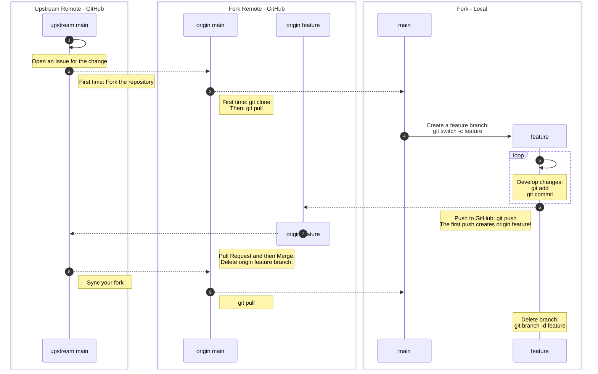

::::::::::::::::::::::::::::::::::::::: objectives

- Create a fork of a repository.
- Contribute to the upstream repository using the fork.

::::::::::::::::::::::::::::::::::::::::::::::::::

:::::::::::::::::::::::::::::::::::::::: questions

- What is a fork?

::::::::::::::::::::::::::::::::::::::::::::::::::

Most open source projects require new collaborators to
contribute via a **fork** of the repository.
A fork is simply a copy of the repository that you make
on the server, in our case GitHub, side.
This avoids having to give repository permissions to
every single collaborator[^access-private].
You may only have one fork of a repository in your
personal space or organisation.

[^access-private]: If the repository is private collaborators will
need to be given access to see the repository and create a fork.
The same is true for private repositories in organisations.

In this episode we will create a fork and contribute
a change to the main GitHub repository using the
feature branch model we have been practising.

We will continue working on the `git-training-demo` repository.
Your permissions have been reduced so that you can no longer push
to the main Met Office repository, you will have to use a fork!
The main Met Office repository is now the **upstream** repository for you fork.

## Open an Issue

Open a new issue like you did earlier to add more detail to
your favourite cloud file.

## Create a Fork

On the repository Code tab click on the **Fork** dropdown arrow
and then the **+ Create a new fork** button:

{alt='A screenshot of the git-training-demo repository showing the fork dropdown with the Create a new fork button.'}

GitHub will take you to the **Create a new fork** page.
There is no need to edit anything on this page.
Click on the green **Create fork** button:

{alt='A screenshot of the GitHub Create a new fork page.'}

You should now see your repository fork.
The repository is marked as a fork by the fork symbol
next to the repository organisation and name in the top
navigation bar.
Under the main repository name you can see a link to the
repository we forked from.
The notification at the bottom of the screenshot shows
whether your forks `main` branch is up to date with the
upstream repository.
If you have commits on your fork not present upstream
you can **Contribute** your changes upstream via a PR.
If your fork is behind the upstream repository
you can **Sync fork** to pull in changes from the
upstream repository.

{alt='A screenshot of a fork of the git-training-demo repository. The repository is marked as a fork by the fork symbol next to the repository name and the link to the original repository under the repository name.'}

## Make Changes

To avoid overwriting your local version of the original Met Office
`git-training-demo` repository you need to clone
your fork to a different location.

To clone the repository into your `Desktop` folder:

```bash
$ git clone git@github.com:mo-fitzroy/git-training-demo.git ~/Desktop/mo-fitzroy-git-training-demo
```

Replace 'mo-fitzroy' with the Owner's username.

If you choose to clone without the clone path
(`~/Desktop/mo-fitzroy-weather`) specified at the end,
you will clone inside the `git-training-demo` folder!

```output
Cloning into '~/Desktop/mo-fitzroy-git-training-demo'...
remote: Enumerating objects: 16, done.
remote: Counting objects: 100% (16/16), done.
remote: Compressing objects: 100% (16/16), done.
remote: Total 16 (delta 1), reused 11 (delta 0), pack-reused 0 (from 0)
Receiving objects: 100% (16/16), 5.01 KiB | 1.00 MiB/s, done.
Resolving deltas: 100% (1/1), done.
```

Create your feature branch:

```bash
$ cd ~/Desktop/mo-fitzroy-git-training-demo
$ git switch -c 2_update_favourite_cloud
```

```output
Switched to a new branch '2_update_favourite_cloud'
```

Add more detail to your favourite cloud file:

```bash
$ nano cloud-mo-fitzroy.md
$ cat cloud-mo-fitzroy.md
```

```output
# My Favourite Cloud

Light and fluffy cumulus.
Nice to sail under.
```

Add and commit your changes:

```bash
$ git add cloud-mo-fitzroy.md
$ git commit -m "Adds more details to Robert FitzRoy's favourite cloud file"
```
```output
[2_update_favourite_cloud 1b05798] Adds more details to Robert FitzRoy's favourite cloud file
 1 file changed, 1 insertion(+)
```

Push the changes to your GitHub fork:

```bash
$ git push
```

```output
Enumerating objects: 5, done.
Counting objects: 100% (5/5), done.
Delta compression using up to 4 threads
Compressing objects: 100% (3/3), done.
Writing objects: 100% (3/3), 369 bytes | 123.00 KiB/s, done.
Total 3 (delta 1), reused 0 (delta 0), pack-reused 0
remote: Resolving deltas: 100% (1/1), completed with 1 local object.
remote:
remote: Create a pull request for '2_update_favourite_cloud' on GitHub by visiting:
remote:      https://github.com/mo-fitzroy/git-training-demo/pull/new/2_update_favourite_cloud
remote:
To github.com:mo-fitzroy/git-training-demo.git
 * [new branch]      2_update_favourite_cloud -> 2_update_favourite_cloud
branch '2_update_favourite_cloud' set up to track 'origin/2_update_favourite_cloud'.
```

## Open a Pull Request

Head back to your fork on GitHub and open a PR to
contribute your changes upstream to the main
`git-training-demo` repository.
You must use the **Fixes** keyword this time to automatically close
your Issue when the PR is merged since you are contributing the change
from a Fork[^link-pr-issue].

[^link-pr-issue]: The [GitHub Documentation](https://docs.github.com/en/issues/tracking-your-work-with-issues/using-issues/linking-a-pull-request-to-an-issue) has more information
on linking PRs to Issues.

{alt='A screenshot of a user opening a pull request from their fork back to the upstream git-training-demo repository. The description has been autofilled with the pull request template contents.'}

The PR will now need to be approved and merged by your instructors.

::::::::::::::::::::::::::::::::::::: instructor

Take a break here!
This will give you and your co-instructor time
to approve, and squash and merge the PRs.

Show learners the Insights -> Network Graph on GitHub again.
Contrast this to the section of the graph from the morning sessions.

::::::::::::::::::::::::::::::::::::::::::::::::

## Updating a Fork

Our fork is now behind the main upstream repository
by one commit.
We are going to update our fork.
First we need to set the correct upstream remote in git.

Switch back to your forks `main` branch:

```bash
$ git switch main
```

Now run:

```bash
$ git remote -v
```

```output
origin	git@github.com:mo-fitzroy/git-training-demo.git (fetch)
origin	git@github.com:mo-fitzroy/git-training-demo.git (push)
```

This shows the GitHub remote links for our fork.
To set the upstream remote we can run:

```bash
$ git remote add upstream git@github.com:MetOffice/git-training-demo.git
$ git remote -v
```

```output
origin	git@github.com:mo-fitzroy/git-training-demo.git (fetch)
origin	git@github.com:mo-fitzroy/git-training-demo.git (push)
upstream	git@github.com:MetOffice/git-training-demo.git (fetch)
upstream	git@github.com:MetOffice/git-training-demo.git (push)
```

Now git knows about the forks upstream repository.
We can fetch the changes to the upstream repository by running:

```bash
$ git fetch upstream
```

```output
remote: Enumerating objects: 6, done.
remote: Counting objects: 100% (6/6), done.
remote: Compressing objects: 100% (2/2), done.
remote: Total 4 (delta 3), reused 2 (delta 2), pack-reused 0 (from 0)
Unpacking objects: 100% (4/4), 1.10 KiB | 41.00 KiB/s, done.
From github.com:MetOffice/git-training-demo
 * [new branch]      main                   -> upstream/main
```

We now have access to the `upstream/main` branch.
To merge in the changes on `upstream/main`:

```bash
$ git merge upstream/main
```

And push:

```bash
$ git push
```

```output
Total 0 (delta 0), reused 0 (delta 0), pack-reused 0
To github.com:mo-fitzroy/git-training-demo.git
   f87bb5c..90808ab  main -> main
```

Your forks `main` branch is now up to date with the
original `git-training-demo` repositories `main` branch.

::: callout

## Sync via GitHub

This is equivalent of syncing your fork via the GitHub banner
shown earlier:

{alt='A screenshot of a users repository showing just the banner announcing the repository is a fork and that is up to date with the upstream repository.'}

If your fork is **behind** the upstream repository
GitHub will alert you on the banner.
You can use the **Sync fork** button to update your fork like we did above.
After syncing your fork this way run `git pull`
on your local `main` branch.

:::

## Summary Diagram

The workflow for forking is similar to that for branching.
There are only a few differences after you've set up your fork
for the first time:

- You should open Issues on the upstream repository not your fork.
- After merging in a PR on the upstream repository you need the
  added step of syncing your forks `main` branch.



:::::::::::::::::::::::::::::::::::::::: keypoints

- A fork is a server side, in our case GitHub, copy
  of the repository.
- Forks allow collaborators to contribute to the main
  repository without being given
  collaborator access or write permissions.

::::::::::::::::::::::::::::::::::::::::::::::::::
