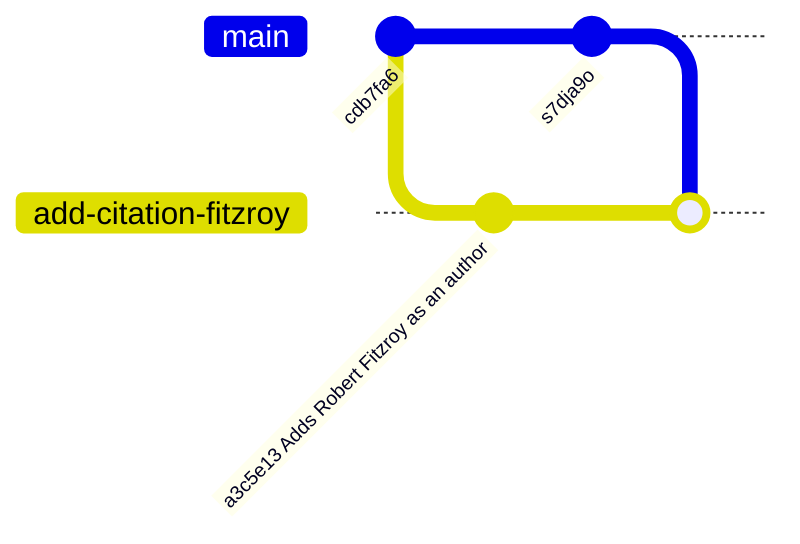

::::::::::::::::::::::::::::::::::::::: objectives

- Explain what conflicts are and when they can occur.
- Resolve conflicts resulting from a merge.

::::::::::::::::::::::::::::::::::::::::::::::::::

:::::::::::::::::::::::::::::::::::::::: questions

- What do I do when my changes conflict with someone else's?

::::::::::::::::::::::::::::::::::::::::::::::::::

As soon as people can work in parallel, they'll likely step on each other's
toes.  This will even happen with a single person: if we are working on
a piece of software on both our laptop and a server in the lab, we could make
different changes to each copy.  Version control helps us manage these
[conflicts](../learners/reference.md#conflict) by giving us tools to
[resolve](../learners/reference.md#resolve) overlapping changes.

Good communication can help avoid conflicts.
In the last episode if we had communicated
that we each needed to edit the `CITATION.cff` file
we could have made our changes sequentially to
avoid the conflict we now have.

## Updating a Fork

Our fork is now behind the main upstream repository
by one commit.
We are going to update our fork.
First we need to set the correct upstream remote in git.

Switch back to your forks `main` branch:

```bash
$ git switch main
```

Now run:

```bash
$ git remote -v
```

```output
origin	git@github.com:mo-fitzroy/git-training-demo.git (fetch)
origin	git@github.com:mo-fitzroy/git-training-demo.git (push)
```

This shows the GitHub remote links for our fork.
To set the upstream remote we can run:

```bash
$ git remote add upstream git@github.com:MetOffice/git-training-demo.git
$ git remote -v
```

```output
origin	git@github.com:mo-fitzroy/git-training-demo.git (fetch)
origin	git@github.com:mo-fitzroy/git-training-demo.git (push)
upstream	git@github.com:MetOffice/git-training-demo.git (fetch)
upstream	git@github.com:MetOffice/git-training-demo.git (push)
```

Now git knows about the forks upstream repository.
We can fetch the changes to the upstream repository by running:

```bash
$ git fetch upstream
```

```output
remote: Enumerating objects: 6, done.
remote: Counting objects: 100% (6/6), done.
remote: Compressing objects: 100% (2/2), done.
remote: Total 4 (delta 3), reused 2 (delta 2), pack-reused 0 (from 0)
Unpacking objects: 100% (4/4), 1.10 KiB | 41.00 KiB/s, done.
From github.com:MetOffice/git-training-demo
 * [new branch]      main                   -> upstream/main
```

We now have access to the `upstream/main` branch.
To merge in the changes on `upstream/main`:

```bash
$ git merge upstream/main
```

```output
Updating f87bb5c..90808ab
Fast-forward
 CITATION.cff | 2 ++
 1 file changed, 2 insertions(+)
```

And push:

```bash
$ git push
```

```output
Total 0 (delta 0), reused 0 (delta 0), pack-reused 0
To github.com:mo-fitzroy/git-training-demo.git
   f87bb5c..90808ab  main -> main
```

Your forks `main` branch is now up to date with the
main `git-training-demo` repositories `main` branch.

## Resolving Conflicts

We're going to resolve the conflict by merging
in our `main` branch into our feature branch
`add-citation-fitzroy`:



Switch to the feature branch:

```bash
$ git switch add-citation-fitzroy
```

```output
Switched to branch 'add-citation-fitzroy'
```

Merge in the `main` branch:

```bash
$ git merge main
```

```output
Auto-merging CITATION.cff
CONFLICT (content): Merge conflict in CITATION.cff
Automatic merge failed; fix conflicts and then commit the result.
```

Git is warning us about the conflict.
We are still merging, if you run `git status` you will see:

```bash
$ git status
```

```output
On branch add-citation-fitzroy
Your branch is up to date with 'origin/add-citation-fitzroy'.

You have unmerged paths.
  (fix conflicts and run "git commit")
  (use "git merge --abort" to abort the merge)

Unmerged paths:
  (use "git add <file>..." to mark resolution)
	both modified:   CITATION.cff

no changes added to commit (use "git add" and/or "git commit -a")
```

The message tells us **both modified** the `CITATION.cff`
file since both `main` and our feature branch modified
this file.

If we look at the `CITATION.cff` file now:

```bash
$ cat CITATION.cff
```

```output
cff-version: 1.2.0
message: "Met Office Colleagues and Partners"
authors:
- family-names: "Theodorakis"
  given-names: "Dimitrios"
  orcid: "https://orcid.org/0000-0001-9288-1332"
<<<<<<< HEAD
- family-names: "FitzRoy"
  given-names: "Robert"
=======
- family-names: "Hogan"
  given-names: "Emma"
>>>>>>> dabb4c8c450e8475aee9b14b4383acc99f42af1d
title: "Met Office Git Training Demo"
version: 2.0.4
doi: 10.4321/zenodo.1234
date-released: 2024-09-23
url: "https://github.com/MetOffice/git-training-demo"
```

Our change is preceded by `<<<<<<< HEAD`.
Git has then inserted `=======` as a separator between the conflicting changes
and marked the end of the content downloaded from GitHub with `>>>>>>>`.
(The string of letters and digits after that marker
identifies the commit we've just downloaded.)

It is now up to us to edit this file to remove these markers
and reconcile the changes.
We can do anything we want: keep the change made in the local repository, keep
the change made in the remote repository, write something new to replace both,
or get rid of the change entirely.
Let's replace both so that the file looks like this:

```bash
$ cat CITATION.cff
```

```output
cff-version: 1.2.0
message: "Met Office Colleagues and Partners"
authors:
- family-names: "Theodorakis"
  given-names: "Dimitrios"
  orcid: "https://orcid.org/0000-0001-9288-1332"
- family-names: "Hogan"
  given-names: "Emma"
- family-names: "FitzRoy"
  given-names: "Robert"
title: "Met Office Git Training Demo"
version: 2.0.4
doi: 10.4321/zenodo.1234
date-released: 2024-09-23
url: "https://github.com/MetOffice/git-training-demo"
```

To finish merging,
we add `CITATION.cff` to the changes being made by the merge
and then commit:

```bash
$ git add CITATION.cff 
$ git status
```

```output
On branch add-citation-fitzroy
All conflicts fixed but you are still merging.
  (use "git commit" to conclude merge)

Changes to be committed:

	modified:   CITATION.cff
```

```bash
$ git commit
```

```output
[add-citation-fitzroy 312c561] Merge branch 'main' into add-citation-fitzroy
```

Now we can push our changes to GitHub:

```bash
$ git push
```

```output
Enumerating objects: 7, done.
Counting objects: 100% (7/7), done.
Delta compression using up to 4 threads
Compressing objects: 100% (3/3), done.
Writing objects: 100% (3/3), 385 bytes | 128.00 KiB/s, done.
Total 3 (delta 2), reused 0 (delta 0), pack-reused 0
remote: Resolving deltas: 100% (2/2), completed with 2 local objects.
To github.com:mo-fitzroy/git-training-demo.git
   a3c5e13..312c561  add-citation-fitzroy -> add-citation-fitzroy
```

Your PR on GitHub should now be ready to merge,
after review of course.

## Avoiding Conflict

Git's ability to resolve conflicts is very useful, but conflict resolution
costs time and effort, and can introduce errors if conflicts are not resolved
correctly. If you find yourself resolving a lot of conflicts in a project,
consider these technical approaches to reducing them:

- Pull from upstream more frequently, especially before starting new work
- Use topic branches to segregate work, merging to main via a PR when complete
- Make smaller more atomic commits
- Push your work when it is done and encourage your team to do the same to reduce work in progress and, by extension, the chance of having conflicts
- Where logically appropriate, break large files into smaller ones so that it is
  less likely that two authors will alter the same file simultaneously

Conflicts can also be minimized with project management strategies:

- Clarify who is responsible for what areas with your collaborators
- Discuss what order tasks should be carried out in with your collaborators so
  that tasks expected to change the same lines won't be worked on simultaneously
- If the conflicts are stylistic churn (e.g. tabs vs. spaces), establish a
  project convention that is governing and use code style tools (e.g.
  `htmltidy`, `perltidy`, `rubocop`, etc.) to enforce, if necessary

:::::::::::::::::::::::::::::::::::::::  challenge

## Conflicts on Non-textual files

What does Git do
when there is a conflict in an image or some other non-textual file
that is stored in version control?

:::::::::::::::  solution

## Solution

Let's try it with your `weather` repository.
Suppose you take a picture of the television forecast and
call it `forecast.jpg`. Jimmy has already created a
feature branch to add the image in.

```bash
$ git switch add_forecast_image
```

If you do not have an image file of forecast available, you can create
a dummy binary file like this:

```bash
$ head --bytes 1024 /dev/urandom > forecast.jpg
$ ls -lh forecast.jpg
```

```output
-rw-r--r-- 1 mo-eormerod 57095 1.0K Mar  8 20:24 forecast.jpg
```

`ls` shows us that this created a 1-kilobyte file. It is full of
random bytes read from the special file, `/dev/urandom`.

Now, suppose you add `forecast.jpg` to your repository:

```bash
$ git add forecast.jpg
$ git commit -m "Add picture of forecast"
```

```output
[add_forecast_image 8e4115c] Add picture of forecast
 1 file changed, 0 insertions(+), 0 deletions(-)
 create mode 100644 forecast.jpg
```

Suppose that Jimmy has added a similar picture in the meantime.
His is a picture of a forecast from Chile, but it is *also* called `forecast.jpg`.
When you try to push, you get a familiar message:

```bash
$ git push
```

```output
To https://github.com/mo-eormerod/weather.git
 ! [rejected]        add_forecast_image -> add_forecast_image (fetch first)
error: failed to push some refs to 'https://github.com/mo-eormerod/weather.git'
hint: Updates were rejected because the remote contains work that you do
hint: not have locally. This is usually caused by another repository pushing
hint: to the same ref. You may want to first integrate the remote changes
hint: (e.g., 'git pull ...') before pushing again.
hint: See the 'Note about fast-forwards' in 'git push --help' for details.
```

We've learned that we must pull first and resolve any conflicts:

```bash
$ git pull
```

When there is a conflict on an image or other binary file, git prints
a message like this:

```output
$ git pull
remote: Counting objects: 3, done.
remote: Compressing objects: 100% (3/3), done.
remote: Total 3 (delta 0), reused 0 (delta 0)
Unpacking objects: 100% (3/3), done.
From https://github.com/mo-eormerod/weather.git
 * branch            add_forecast_image     -> FETCH_HEAD
   6a67967..439dc8c  add_forecast_image     -> origin/add_forecast_image
warning: Cannot merge binary files: forecast.jpg (HEAD vs. 439dc8c08869c342438f6dc4a2b615b05b93c76e)
Auto-merging forecast.jpg
CONFLICT (add/add): Merge conflict in forecast.jpg
Automatic merge failed; fix conflicts and then commit the result.
```

The conflict message here is mostly the same as it was for `forecast.md`, but
there is one key additional line:

```output
warning: Cannot merge binary files: forecast.jpg (HEAD vs. 439dc8c08869c342438f6dc4a2b615b05b93c76e)
```

Git cannot automatically insert conflict markers into an image as it does
for text files. So, instead of editing the image file, we must check out
the version we want to keep. Then we can add and commit this version.

On the key line above, Git has conveniently given us commit identifiers
for the two versions of `forecast.jpg`. Our version is `HEAD`, and Jimmy's
version is `439dc8c0...`. If we want to use our version, we can use
`git checkout`:

```bash
$ git checkout HEAD forecast.jpg
$ git add forecast.jpg
$ git commit -m "Use image of just the local forecast"
```

```output
[add_forecast_image 21032c3] Use image of just the local forecast
```

If instead we want to use Jimmy's version, we can use `git checkout` with
Jimmy's commit identifier, `439dc8c0`:

```bash
$ git checkout 439dc8c0 forecast.jpg
$ git add forecast.jpg
$ git commit -m "Use image of just the local forecast"
```

```output
[add_forecast_image da21b34] Use image of forecast with nachos instead of just forecast
```

We can also keep *both* images. The catch is that we cannot keep them
under the same name. But, we can check out each version in succession
and *rename* it, then add the renamed versions. First, check out each
image and rename it:

```bash
$ git checkout HEAD forecast.jpg
$ git mv forecast.jpg forecast-only.jpg
$ git checkout 439dc8c0 forecast.jpg
$ mv forecast.jpg forecast-chile.jpg
```

Then, remove the old `forecast.jpg` and add the two new files:

```bash
$ git rm forecast.jpg
$ git add forecast-only.jpg
$ git add forecast-chile.jpg
$ git commit -m "Use two images: local forecast and Chile forecast"
```

```output
[add_forecast_image 94ae08c] Use two images: local forecast and Chile forecast
 2 files changed, 0 insertions(+), 0 deletions(-)
 create mode 100644 forecast-chile.jpg
 rename forecast.jpg => forecast-only.jpg (100%)
```

Now both images of forecast are checked into the repository, and `forecast.jpg`
no longer exists.

:::::::::::::::::::::::::

::::::::::::::::::::::::::::::::::::::::::::::::::

:::::::::::::::::::::::::::::::::::::::: keypoints

- Conflicts occur when two or more people change the same lines of the same file.
- The version control system does not allow people to overwrite each other's changes blindly, but highlights conflicts so that they can be resolved.

::::::::::::::::::::::::::::::::::::::::::::::::::
 