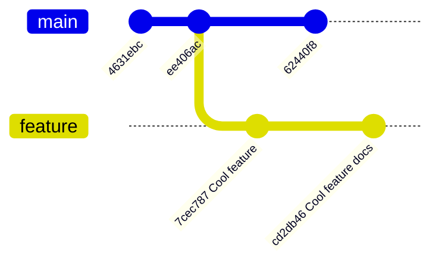
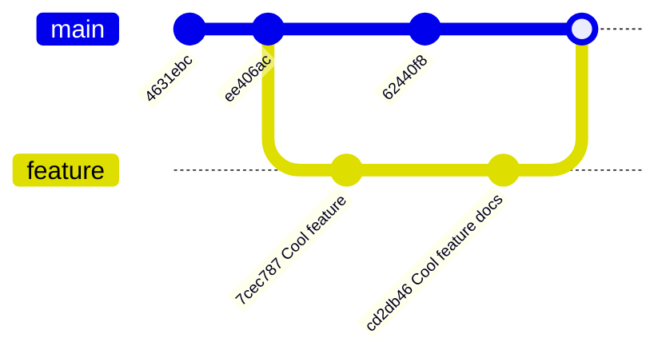
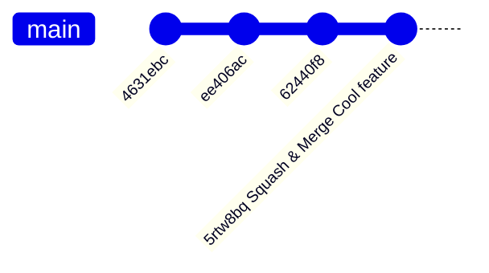
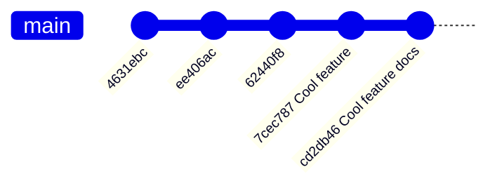

::::::::::::::::::::::::::::::::::::::: objectives

- Visualise our git history.
- Learn the difference between merge, squash merge, and rebase.

::::::::::::::::::::::::::::::::::::::::::::::::::

:::::::::::::::::::::::::::::::::::::::: questions

- Why is a linear history useful?

::::::::::::::::::::::::::::::::::::::::::::::::::

The history of your repository is simply
its commits.
A more linear history is easier to understand
and can be helpful when using certain git
commands to explore your history.

## Viewing History

You have already learnt that we can use the
`git log` command to output the commit history
of our repository.

```bash
$ git log
```

```output
commit acce45c86ece7fd4823ddc6c1addb43edf4c0794
Merge: e3fc783 ca8aca9
Author: Robert FitzRoy <r.fitzroy@mo-weather.uk>
Date:   Mon Sep 23 15:50:15 2024 +0100

    Merge pull request #1 from MetOffice/mo-fitzroy-patch-1
    
    Create CITATION.cff

commit ca8aca9f2f43a4d799eb5c9ce9596b42360faa8b
Author: Robert FitzRoy <r.fitzroy@mo-weather.uk>
Date:   Mon Sep 23 15:49:36 2024 +0100

    Create CITATION.cff

commit e3fc783648222d5eef0739922b06794b8d690341
Author: Robert FitzRoy <r.fitzroy@mo-weather.uk>
Date:   Fri Sep 20 13:01:05 2024 +0100

    Initial commit
```

This shows the first 3 commits to the `git-training-demo` repository (the full output isn't shown here because it's very long).
We can use certain flags with `git log` to better
visualise the history in graph form:

```bash
$ git log --decorate --oneline --graph
```

```output
*   d800b46 (HEAD -> main, origin/main, origin/HEAD) Merge pull request #2 from MetOffice/mo-fitzroy-patch-2
|\  
| * dbc944d Add pre-commit checks
|/  
*   acce45c Merge pull request #1 from MetOffice/mo-fitzroy-patch-1
|\  
| * ca8aca9 Create CITATION.cff
|/  
* e3fc783 Initial commit
```

The [GitHub Documentation for git log](https://git-scm.com/docs/git-log) has    information on all the available flags.
The key here is `--graph` shows us the graphical
representation of our history on the left of the
terminal.
`*`'s are commits which are connected by lines.
The vertical lines on the far left represent the `main` branch.
The output above shows two feature branches each with
only one commit which were then merged back into
`main` via a pull request.

You can either remember the flags using
the phrase "git dog", `d` for `--decorate`,
`o` for `--oneline`, `g` for `--graph` or
you can set an alias for the `git log` command:

```bash
$ git config --global alias.dog "log --decorate --oneline --graph"
```

This alias makes these two commands equivalent:

```bash
$ git dog
$ git log --decorate --oneline --graph
```

You can of course customise the log command
with other keywords and set more aliases for
different log views.
Some useful examples can be found on
[this Stackoverflow comment](https://stackoverflow.com/questions/1838873/visualizing-branch-topology-in-git/34467298#34467298).

::: callout

### IDE Git History Extensions

Your IDE may have extensions which render your
git history as easy to read graphs.
If you use VSCode we recommend the [Git Graph extension](https://marketplace.visualstudio.com/items?itemName=mhutchie.git-graph).

:::

## Merge Options

When you opened your PRs you were given
three options for merging your feature
branch into `main`.
We will now explore how each merging method
affects the history of your repository.
In all the examples below we start with the same git history.

### Merge

Starting with:



Using merge creates a merge commit joining
the two branches:



This results in a non-linear history which
can be hard to navigate.
You can avoid this non-linear history by rebasing
your `feature` branch before you merge.
Rebasing a branch before you submit a PR for
review is covered in the next episode.

Some teams choose to use Merge because it
keeps all the individual commits that made
up your change so more accurately represents
the history of your repository.

### Squash and Merge

Starting with:


Squashing before merging squashes all the
commits on the feature branch into one
commit which is then merged onto main:



The last commit on main `5rtw8bq Squash & Merge Cool feature`
is the two feature branch commits squashed
together into a new one.

Here the history is linear but all our commits
have been squashed into one.
If you have a very large branch with many commits
you might not want to squash them all into one commit.
Squashing in this case will make bug hunting harder.
Remember you should try and break work down into
small pieces so you avoid huge branches.

### Rebase

Starting with:


Rebase re-writes your git history removing
the `feature` branch commits from the `feature`
branch and adding them to `main`:



::: caution

### Rebase Re-Writes History

Rebasing re-writes your git history.
Do **NOT** rebase shared branches such as `main`.

:::

Since rebase re-writes your history you have to force
push to the GitHub remote to override your remotes history.
The history in this case is linear and retains all
the commits which makes it easier to search for
a commit that introduced a bug.

Your team will decide what approach is right
for your project.
If you choose to perform normal merge's on
your PRs we recommend rebasing your feature branch
before the PR is ready for review.

:::::::::::::::::::::::::::::::::::::::: keypoints

- `git log --decorate --oneline --graph` lets you visualise your repository history in graph form.
- There are three options for merging your feature
branch into `main`.
- merge: creates a merge commit and results in a non-linear history unless you first rebase your feature branch
- squash and merge: squashes all your feature branch commits into one merge commit on `main`. Your history is linear.
- rebase: re-writes your git history so that all the feature branch commits are now on `main`. Your history is linear. 

::::::::::::::::::::::::::::::::::::::::::::::::::
