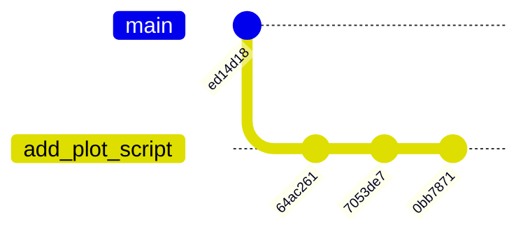
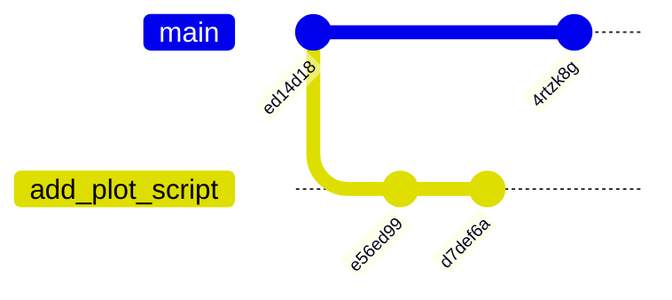
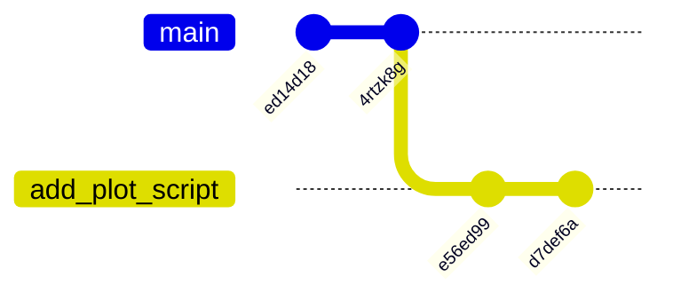

::::::::::::::::::::::::::::::::::::::: objectives

- Rebase a feature branch.

::::::::::::::::::::::::::::::::::::::::::::::::::

:::::::::::::::::::::::::::::::::::::::: questions

- When should I rebase?

::::::::::::::::::::::::::::::::::::::::::::::::::

Rebasing a branch re-writes your git history and
should be used with caution.
You might want to rebase if:

- You need to tidy up your branches history before
  performing a normal merge via a PR.
  This will help keep the history of the `main`
  branch linear.
- You need to update your branch with changes from the
  `main` branch.

## Tidying your Commit History

Consider the following scenario.
You want to add a plotting script to the
`git-training-demo` repository.
You make a branch for the feature:

```bash
$ git switch -c add_plot_script main
```

```output
Switched to branch 'add_plot_script'
```

And over the course of development you make
three commits to the file `plot_lfric.py`.
Use the commands in each tab make the same
commits to your repository:

::: tab

### Commit 1

```bash
$ nano plot_lfric.py
$ cat plot_lfric.py
```

```output
# pretnd there is code here!
```

```bash
$ git add plot_lfric.py
$ git commit -m "Adds in a Python script to plot LFRic data"
```

```output
[add_plot_script 64ac261] Adds in a Python script to plot LFRic data
 1 file changed, 0 insertions(+), 0 deletions(-)
 create mode 100644 plot_lfric.py
```

### Commit 2

```bash
$ nano plot_lfric.py
$ cat plot_lfric.py
```

```output
# pretnd there is code here!
# more Python
```

```bash
$ git commit -am "Extends the LFRic data plotting script to plot 2D fields"
```

```output
[add_plot_script 7053de7] Extends the LFRic data plotting script to plot 2D fields
 1 file changed, 1 insertion(+)
```

### Commit 3

```bash
$ nano plot_lfric.py
$ cat plot_lfric.py
```

```output
# pretend there is code here!
# more Python
```

```bash
$ git commit -am "Fixes the axis labels spelling in the LFRic data plotting script"
```

```output
[add_plot_script 0bb7871] Fixes the axis labels spelling in the LFRic data plotting script
 1 file changed, 1 insertion(+)
```

:::

Before you push to the remote and open a PR
you check your git history.
The git history now looks something like this:



We can also visualise these changes with `git log`:

```bash
$ git log --decorate --oneline --graph
```

```output
* 0bb7871 (HEAD -> add_plot_script) Fixes the axis labels spelling in the LFRic data plotting script
* 7053de7 Extends the LFRic data plotting script to plot 2D fields
* 64ac261 Adds in a Python script to plot LFRic data
* ed14d18 (origin/main) Adds Robert FitzRoy as an author (#8)
```

You realise that perhaps the spelling fix in the
third commit should have been a correction
to the first commit which added in the script.
We can use rebase to re-write our history and
combine these two commits.

::: caution

## Backup your Branch

It is a good idea to create a backup of your
feature branch just in case something
goes wrong during the rebase:

```bash
$ git branch add_plot_script.backup
```

:::

We will rebase interactively using the `-i` flag.
To rebase our three commits we need to provide
the commit hash for the commit before our
three feature branch commits which is `ed14d18`
from the log above:

```bash
git rebase -i ed14d18
```

```output
pick 64ac261 Adds in a Python script to plot LFRic data
pick 7053de7 Extends the LFRic data plotting script to plot 2D fields
pick 0bb7871 Fixes the axis labels spelling in the LFRic data plotting script

# Rebase ed14d18..0bb7871 onto ed14d18 (3 commands)
#
# Commands:
# p, pick <commit> = use commit
# r, reword <commit> = use commit, but edit the commit message
# e, edit <commit> = use commit, but stop for amending
# s, squash <commit> = use commit, but meld into previous commit
# f, fixup [-C | -c] <commit> = like "squash" but keep only the previous
#                    commit's log message, unless -C is used, in which case
#                    keep only this commit's message; -c is same as -C but
#                    opens the editor
# x, exec <command> = run command (the rest of the line) using shell
# b, break = stop here (continue rebase later with 'git rebase --continue')
# d, drop <commit> = remove commit
# l, label <label> = label current HEAD with a name
# t, reset <label> = reset HEAD to a label
# m, merge [-C <commit> | -c <commit>] <label> [# <oneline>]
# .	  create a merge commit using the original merge commit's
# .	  message (or the oneline, if no original merge commit was
# .	  specified); use -c <commit> to reword the commit message
#
# These lines can be re-ordered; they are executed from top to bottom.
#
# If you remove a line here THAT COMMIT WILL BE LOST.
#
# However, if you remove everything, the rebase will be aborted.
#
```

This file shows our three commits in order
from oldest to newest.
It also gives us options for each commit.
You can re-arrange commit lines to re-order
your history.

::: caution

## Aborting a Rebase

If you want to cancel the rebase at the above stage
either do nothing to the file or delete all the
commit lines.

After you save and close the file, if your rebase
has conflicts, you can abort at anytime using:

```bash
$ git rebase --abort
```

:::

We are going to move our spelling fix up one
line and use the `fixup` keyword to merge
those changes with the previous commit:

```output
pick 64ac261 Adds in a Python script to plot LFRic data
fixup 0bb7871 Fixes the axis labels spelling in the LFRic data plotting script
pick 7053de7 Extends the LFRic data plotting script to plot 2D fields
```

Save the and close the file.

```output
Auto-merging plot_lfric.py
CONFLICT (content): Merge conflict in plot_lfric.py
error: could not apply 0bb7871... Fixes the axis labels spelling in the LFRic data plotting script
hint: Resolve all conflicts manually, mark them as resolved with
hint: "git add/rm <conflicted_files>", then run "git rebase --continue".
hint: You can instead skip this commit: run "git rebase --skip".
hint: To abort and get back to the state before "git rebase", run "git rebase --abort".
Could not apply 0bb7871... Fixes the axis labels spelling in the LFRic data plotting script
```

The first commit adding the file and the spelling
fix commit inevitable conflicted with each other
since the file in the spelling fix commit also has
the changes from the original second commit.

Opening up the file now shows:

```bash
[git-training-demo]:(add_plot_script *+|REBASE 2/3)$ nano plot_lfric.py
```

```
<<<<<<< HEAD
# pretnd there is code here!
=======
# pretend there is code here!
# more Python
>>>>>>> 0bb7871 
```

Modify and save the file so that it reads:

```
# pretend there is code here!
```

This is the combination of our first and third commits.
Add the file and continue rebasing:

```bash
[git-training-demo]:(add_plot_script *+|REBASE 2/3)$ git add plot_lfric.py 
[git-training-demo]:(add_plot_script +|REBASE 2/3)$ git rebase --continue 
```

For the last few commands we have included the
full terminal prompt showing the git status
provided by the `git-prompt.sh` script
you set up in the [git-novice lesson](https://www.astropython.com/git-novice/index.html#git-autocomplete).
You can see the prompt clearly states we are
rebasing, `REBASE`, and that it is on
line `2/3` of the file we edited earlier.

We now see the following output:

```output
[detached HEAD e56ed99] Adds in a Python script to plot LFRic data
 Date: Sat Nov 16 19:53:42 2024 +0000
 1 file changed, 1 insertion(+)
 create mode 100644 plot_lfric.py
Auto-merging plot_lfric.py
CONFLICT (content): Merge conflict in plot_lfric.py
error: could not apply 7053de7... Extends the LFRic data plotting script to plot 2D fields
hint: Resolve all conflicts manually, mark them as resolved with
hint: "git add/rm <conflicted_files>", then run "git rebase --continue".
hint: You can instead skip this commit: run "git rebase --skip".
hint: To abort and get back to the state before "git rebase", run "git rebase --abort".
Could not apply 7053de7... Extends the LFRic data plotting script to plot 2D fields
```

The rebase has tried to apply the third commit
which has resulted in another merge error.
Open the file again to resolve the conflict:

```bash
[git-training-demo]:(add_plot_script *+|REBASE 3/3)$ nano plot_lfric.py 
[git-training-demo]:(add_plot_script *+|REBASE 3/3)$ cat plot_lfric.py 
```

```output
# pretend there is code here!
# more Python
```

Add the file and continue with the rebase:

```bash
[git-training-demo]:(add_plot_script *+|REBASE 3/3)$ git add plot_lfric.py
[git-training-demo]:(add_plot_script +|REBASE 3/3)$ git rebase --continue
```

```output
[detached HEAD d7def6a] Extends the LFRic data plotting script to plot 2D fields
 1 file changed, 1 insertion(+)
Successfully rebased and updated refs/heads/add_plot_script.
```

We have now successfully rebased our feature branch.
Our history shows:

```bash
$ git log --decorate --oneline --graph
```

```output
* d7def6a (HEAD -> add_plot_script) Extends the LFRic data plotting script to plot 2D fields
* e56ed99 Adds in a Python script to plot LFRic data
* ed14d18 (origin/main) Adds Robert FitzRoy as an author (#8)
```

::: callout

## detached HEAD

You may have noticed in some of the terminal
outputs above the phrase `detached HEAD`.
Remember `HEAD` simply points to the latest
commit in a branch.
You can't re-write the commit history of a
branch while you are on the branch!
`git rebase` moved you into a `detached HEAD`
space where you aren't on any branch
to perform the rebase.
When the rebase successfully completed git
re-attached `HEAD` to point to the new
most recent commit, `d7def6a` in the
output above, on the feature branch.

:::

## Updating a Branch

You can also use rebase to move your changes to
branch off the `HEAD` of `main`.
While we rebased our feature branch another
PR was merged with `main`:



We can use rebasing to move our feature branch
so it branches off the `HEAD` of `main`,
fixing any conflicts that arise.
This is what we are aiming for:



Simply run:

```bash
$ git rebase main
```

```output
Successfully rebased and updated refs/heads/add_plot_script.
```

That's it!
There were no merge conflicts to resolve this time.
If you are going to use rebase in this way
consider rebasing on a regular basis.

::: caution

## Merge & Rebase

Stick to one strategy if you can, or rebase before
merging.
Rebasing a branch with merge commits
is difficult to impossible.

:::

## Updating the Remote

If you are rebasing a feature branch you have
already pushed to the GitHub remote you
will need to overwrite the remote branch.

- **Always** check you have updated your local
branch from the remote **before** rebasing.
- **Always** check before pushing to the remote
after rebasing that no new commits were added
to the remote as these will be lost.

You can fetch any changes to the remote:

```bash
$ git fetch
```

And inspect the last commit with the log or `git show`
to make sure it's the commit you expect:

```bash
$ git show origin/add_plot_script
```

If the rebasing was successful and there have
been no new commits to the remote feature branch
by any collaborators it is safe to push the rebased
feature branch to the GitHub remote, overwriting
it's history.

```bash
git push --force-with-lease
```

The `--force-with-lease` flag will warn you
if there are commits on the remote branch
you would override by pushing if you forgot
to check yourself.

:::::::::::::::::::::::::::::::::::::::  challenge

## Modifying Commits and their Messages

`git rebase` can also be used to modify individual commits
and their messages.
So instead of creating a new commit to fix a typo you
could use rebase to edit the commit directly.

Look again at the output of the interactive rebase
in this lesson. Which keywords let you:

1. Edit the contents of a commit
2. Edit the commit message

:::::::::::::::  solution

## Solution

1. Edit the contents of a commit

```
# e, edit <commit> = use commit, but stop for amending
```

2. Edit the commit message

```
# r, reword <commit> = use commit, but edit the commit message
```

:::::::::::::::::::::::::

::::::::::::::::::::::::::::::::::::::::::::::::::

:::::::::::::::::::::::::::::::::::::::: keypoints

- Rebasing helps keep your git history linear which
  can be useful when using commands such as git
  bisect to find the commit that introduced a bug.
- Rebasing re-writes your git history.
  Make a backup of your branch before rebasing.
  `git branch <branch-name>.backup`
- Use an interactive rebase with the `-i` flag
  when you want to tidy your git history.
- Use `git rebase main` to rebase your feature
  branch onto the `HEAD` of the `main` branch.
- **Always** check you have updated your local
  branch from the remote **before** rebasing.
- **Always** check before pushing to the remote
  after rebasing that no new commits were added
  to the remote as these will be lost.
- Use `git push --force-with-lease` to update the
  remote branch.

::::::::::::::::::::::::::::::::::::::::::::::::::
